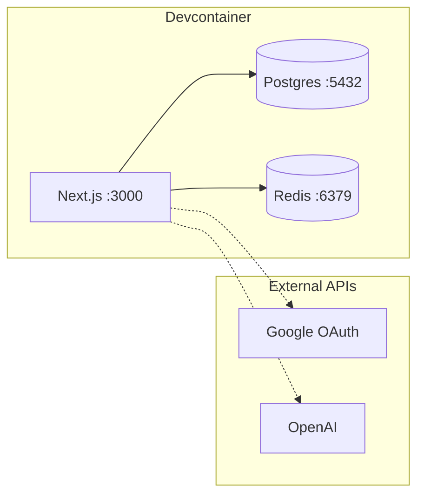

# Devcontainer Setup

## Architecture



## Quick Start

### 1. Open in VS Code

```
Cmd+Shift+P → Dev Containers: Reopen in Container
```

Setup runs automatically (installs deps, generates secrets, runs migrations).

### 2. Add your API keys to `apps/web/.env`

| Variable | Source |
|----------|--------|
| `GOOGLE_CLIENT_ID` | [Google Cloud Console](https://console.cloud.google.com/apis/credentials) |
| `GOOGLE_CLIENT_SECRET` | Same |
| `OPENAI_API_KEY` | [OpenAI Platform](https://platform.openai.com/api-keys) |

**Google OAuth setup:**
- Create OAuth 2.0 Client ID (Web application)
- Authorized origin: `http://localhost:3000`
- Redirect URI: `http://localhost:3000/api/auth/callback/google`

### 3. Run

```bash
pnpm dev
```

Open http://localhost:3000

## What's auto-configured

- PostgreSQL + Redis (local containers)
- Auth secrets (auto-generated)
- LLM config (OpenAI gpt-4o / gpt-4o-mini)
