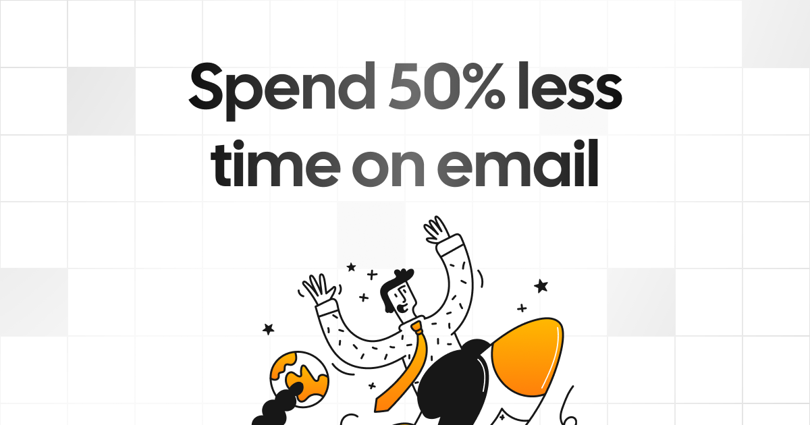
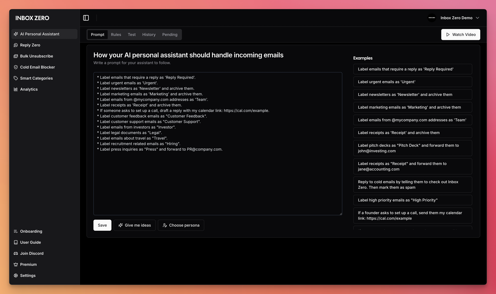
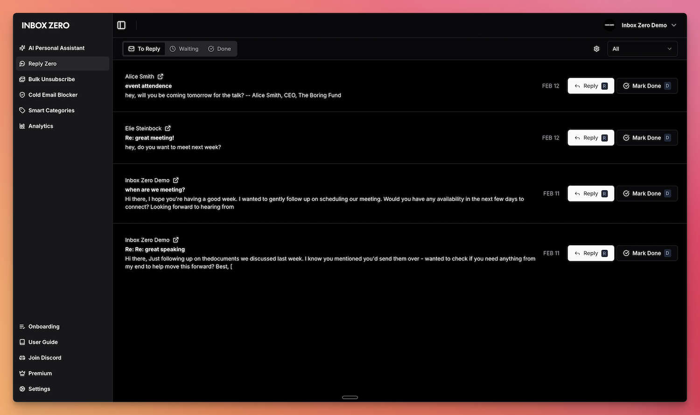
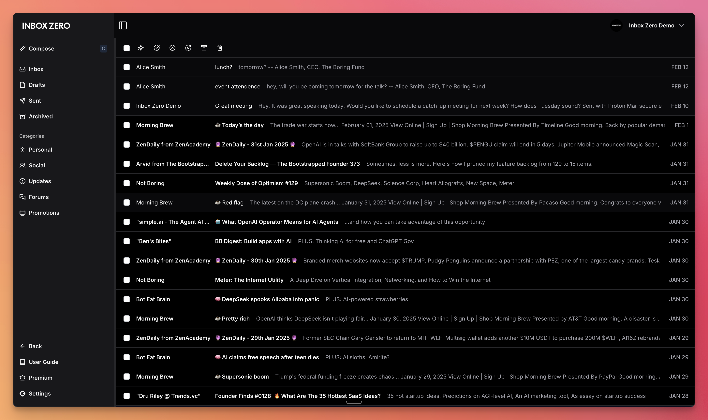
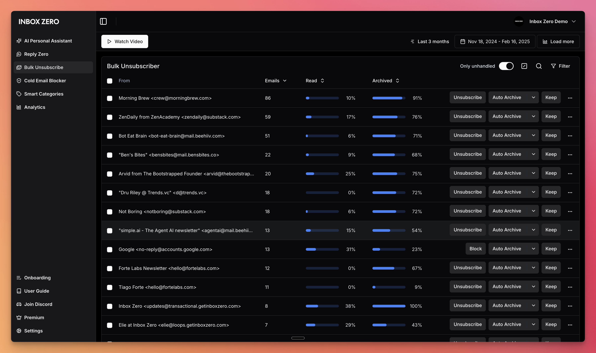

[](https://www.getinboxzero.com)

<p align="center">
  <a href="https://www.getinboxzero.com">
    <h1 align="center">Inbox Zero - your 24/7 AI email assistant</h1>
  </a>
  <p align="center">
    Organizes your inbox, pre-drafts replies, and tracks follow‑ups—so you reach inbox zero faster. Open source.
    <br />
    <a href="https://www.getinboxzero.com">Website</a>
    ·
    <a href="https://www.getinboxzero.com/discord">Discord</a>
    ·
    <a href="https://github.com/elie222/inbox-zero/issues">Issues</a>
  </p>
</p>

<div align="center">


<a href="https://trendshift.io/repositories/6400" target="_blank"></a>

[](https://vercel.com/oss)

</div>

## About

There are two parts to Inbox Zero:

1. An AI email assistant that helps you spend less time on email.
2. Open source AI email client.

If you're looking to contribute to the project, the email client is the best place to do this.

<br />

[](https://vercel.com/new/clone?repository-url=https%3A%2F%2Fgithub.com%2Felie222%2Finbox-zero&env=AUTH_SECRET,GOOGLE_CLIENT_ID,GOOGLE_CLIENT_SECRET,MICROSOFT_CLIENT_ID,MICROSOFT_CLIENT_SECRET,EMAIL_ENCRYPT_SECRET,EMAIL_ENCRYPT_SALT,UPSTASH_REDIS_URL,UPSTASH_REDIS_TOKEN,GOOGLE_PUBSUB_TOPIC_NAME,DATABASE_URL,NEXT_PUBLIC_BASE_URL)

## Features

- **AI Personal Assistant:** Manages your email for you based on a plain text prompt file. It can take any action a human assistant can take on your behalf (Draft reply, Label, Archive, Reply, Forward, Mark Spam, and even call a webhook).
- **Reply Zero:** Track emails that need your reply and those awaiting responses.
- **Smart Categories:** Categorize everyone that's ever emailed you.
- **Bulk Unsubscriber:** Quickly unsubscribe from emails you never read in one-click.
- **Cold Email Blocker:** Automatically block cold emails.
- **Email Analytics:** Track your email activity with daily, weekly, and monthly stats.

Learn more in our [docs](https://docs.getinboxzero.com).

## Feature Screenshots

|  |                |
| :------------------------------------------------------: | :-------------------------------------------------------------: |
|                      _AI Assistant_                      |                          _Reply Zero_                           |
|     |  |
|                      _Gmail client_                      |                       _Bulk Unsubscriber_                       |

## Demo Video

[](http://www.youtube.com/watch?v=hfvKvTHBjG0)

## Built with

- [Next.js](https://nextjs.org/)
- [Tailwind CSS](https://tailwindcss.com/)
- [shadcn/ui](https://ui.shadcn.com/)
- [Prisma](https://www.prisma.io/)
- [Upstash](https://upstash.com/)
- [Turborepo](https://turbo.build/)

## Star History

[](https://www.star-history.com/#elie222/inbox-zero&Date)

## Feature Requests

To request a feature open a [GitHub issue](https://github.com/elie222/inbox-zero/issues), or join our [Discord](https://www.getinboxzero.com/discord).

## Getting Started for Developers

We offer a hosted version of Inbox Zero at [https://getinboxzero.com](https://getinboxzero.com). To self-host follow the steps below.

### Setup

[Here's a video](https://youtu.be/hVQENQ4WT2Y) on how to set up the project. It covers the same steps mentioned in this document. But goes into greater detail on setting up the external services.

### Requirements

- [Node.js](https://nodejs.org/en/) >= 18.0.0
- [pnpm](https://pnpm.io/) >= 8.6.12
- [Docker desktop](https://www.docker.com/products/docker-desktop/) (recommended but optional)

Make sure you have the above installed before starting.

The external services that are required are (detailed setup instructions below):

- [Google OAuth](https://console.cloud.google.com/apis/credentials)
- [Google PubSub](https://console.cloud.google.com/cloudpubsub/topic/list)

### Updating .env file: secrets

Create your own `.env` file from the example supplied:

```bash
cp apps/web/.env.example apps/web/.env
cd apps/web
pnpm install
```

Set the environment variables in the newly created `.env`. You can see a list of required variables in: `apps/web/env.ts`.

The required environment variables:

- `AUTH_SECRET` -- can be any random string (try using `openssl rand -hex 32` for a quick secure random string)
- `EMAIL_ENCRYPT_SECRET` -- Secret key for encrypting OAuth tokens (try using `openssl rand -hex 32` for a secure key)
- `EMAIL_ENCRYPT_SALT` -- Salt for encrypting OAuth tokens (try using `openssl rand -hex 16` for a secure salt)


- `NEXT_PUBLIC_BASE_URL` -- The URL where your app is hosted (e.g., `http://localhost:3000` for local development or `https://yourdomain.com` for production).
- `INTERNAL_API_KEY` -- A secret key for internal API calls (try using `openssl rand -hex 32` for a secure key)

- `UPSTASH_REDIS_URL` -- Redis URL from Upstash. (can be empty if you are using Docker Compose)
- `UPSTASH_REDIS_TOKEN` -- Redis token from Upstash. (or specify your own random string if you are using Docker Compose)

When using Vercel with Fluid Compute turned off, you should set `MAX_DURATION=300` or lower. See Vercel limits for different plans [here](https://vercel.com/docs/functions/configuring-functions/duration#duration-limits).

### Updating .env file with Google OAuth credentials:

- `GOOGLE_CLIENT_ID` -- Google OAuth client ID. More info [here](https://next-auth.js.org/providers/google)
- `GOOGLE_CLIENT_SECRET` -- Google OAuth client secret. More info [here](https://next-auth.js.org/providers/google)

Go to [Google Cloud](https://console.cloud.google.com/). Create a new project if necessary.

Create [new credentials](https://console.cloud.google.com/apis/credentials):

1.  If the banner shows up, configure **consent screen** (if not, you can do this later)
    1. Click the banner, then Click `Get Started`.
    2. Choose a name for your app, and enter your email.
    3. In Audience, choose `External`
    4. Enter your contact information
    5. Agree to the User Data policy and then click `Create`.
    6. Return to APIs and Services using the left sidebar.
2.  Create new [credentials](https://console.cloud.google.com/apis/credentials):
    1. Click the `+Create Credentials` button. Choose OAuth Client ID.
    2. In `Application Type`, Choose `Web application`
    3. Choose a name for your web client
    4. In Authorized JavaScript origins, add a URI and enter `http://localhost:3000`
    5. In `Authorized redirect URIs` enter:
      - `http://localhost:3000/api/auth/callback/google`
      - `http://localhost:3000/api/google/linking/callback`
    6. Click `Create`.
    7. A popup will show up with the new credentials, including the Client ID and secret.
3.  Update .env file:
    1. Copy the Client ID to `GOOGLE_CLIENT_ID`
    2. Copy the Client secret to `GOOGLE_CLIENT_SECRET`
4.  Update [scopes](https://console.cloud.google.com/auth/scopes)

    1. Go to `Data Access` in the left sidebar (or click link above)
    2. Click `Add or remove scopes`
    3. Copy paste the below into the `Manually add scopes` box:

    ```plaintext
    https://www.googleapis.com/auth/userinfo.profile
    https://www.googleapis.com/auth/userinfo.email
    https://www.googleapis.com/auth/gmail.modify
    https://www.googleapis.com/auth/gmail.settings.basic
    https://www.googleapis.com/auth/contacts
    ```

    4. Click `Update`
    5. Click `Save` in the Data Access page.

5.  Add yourself as a test user
    1. Go to [Audience](https://console.cloud.google.com/auth/audience)
    2. In the `Test users` section, click `+Add users`
    3. Enter your email and press `Save`

### Updating .env file with Microsoft OAuth credentials:

- `MICROSOFT_CLIENT_ID` -- Microsoft OAuth client ID
- `MICROSOFT_CLIENT_SECRET` -- Microsoft OAuth client secret

Go to [Microsoft Azure Portal](https://portal.azure.com/). Create a new Azure Active Directory app registration:

1. Navigate to Azure Active Directory
2. Go to "App registrations" in the left sidebar or search it in the searchbar
3. Click "New registration"

   1. Choose a name for your application
   2. Under "Supported account types" select "Accounts in any organizational directory (Any Azure AD directory - Multitenant) and personal Microsoft accounts (e.g. Skype, Xbox)"
   3. Set the Redirect URI:
      - Platform: Web
      - URL: `http://localhost:3000/api/auth/callback/microsoft`
   4. Click "Register"
   5. In the "Manage" menu click "Authentication (Preview)"
   6. Add the Redirect URI: `http://localhost:3000/api/outlook/linking/callback`

4. Get your credentials:

   1. The "Application (client) ID" shown is your `MICROSOFT_CLIENT_ID`
   2. To get your client secret:
      - Click "Certificates & secrets" in the left sidebar
      - Click "New client secret"
      - Add a description and choose an expiry
      - Click "Add"
      - Copy the secret Value (not the ID) - this is your `MICROSOFT_CLIENT_SECRET`

5. Configure API permissions:

   1. In the "Manage" menu click "API permissions" in the left sidebar
   2. Click "Add a permission"
   3. Select "Microsoft Graph"
   4. Select "Delegated permissions"
   5. Add the following permissions:

      - openid
      - profile
      - email
      - User.Read
      - offline_access
      - Mail.ReadWrite
      - Mail.Send
      - Mail.ReadBasic
      - Mail.Read
      - Mail.Read.Shared
      - MailboxSettings.ReadWrite
      - Contacts.ReadWrite

   6. Click "Add permissions"
   7. Click "Grant admin consent" if you're an admin

6. Update your .env file with the credentials:
   ```plaintext
   MICROSOFT_CLIENT_ID=your_client_id_here
   MICROSOFT_CLIENT_SECRET=your_client_secret_here
   ```

### Updating .env file with LLM parameters

You need to set an LLM, but you can use a local one too:

- [Anthropic](https://console.anthropic.com/settings/keys)
- [OpenAI](https://platform.openai.com/api-keys)
- AWS Bedrock Anthropic
- Google Gemini
- Groq Llama 3.3 70B
- Ollama (local)

For the LLM, you can use Anthropic, OpenAI, or Anthropic on AWS Bedrock. You
can also use Ollama by setting the following enviroment variables:

```sh
OLLAMA_BASE_URL=http://localhost:11434/api
NEXT_PUBLIC_OLLAMA_MODEL=phi3
```

Note: If you need to access Ollama hosted locally and the application is running on Docker setup, you can use `http://host.docker.internal:11434/api` as the base URL. You might also need to set `OLLAMA_HOST` to `0.0.0.0` in the Ollama configuration file.

You can select the model you wish to use in the app on the `/settings` page of the app.

If you are using local ollama, you can set it to be default:

```sh
DEFAULT_LLM_PROVIDER=ollama
```

If this is the case you must also set the `ECONOMY_LLM_PROVIDER` environment variable.

### Redis and Postgres

We use Postgres for the database.
For Redis, you can use [Upstash Redis](https://upstash.com/) or set up your own Redis instance.

You can run Postgres & Redis locally using `docker-compose`

```bash
docker-compose up -d # -d will run the services in the background
```

### Running the app

To run the migrations:

```bash
pnpm prisma migrate dev
```

To run the app locally for development (slower):

```bash
pnpm run dev
```

Or from the project root:

```bash
turbo dev
```

To build and run the app locally in production mode (faster):

```bash
pnpm run build
pnpm start
```

Open [http://localhost:3000](http://localhost:3000) to view the app in your browser.

### Premium

Many features are available only to premium users. To upgrade yourself, make yourself an admin in the `.env`: `ADMINS=hello@gmail.com`
Then upgrade yourself at: [http://localhost:3000/admin](http://localhost:3000/admin).

### Set up push notifications via Google PubSub to handle emails in real time

Follow instructions [here](https://developers.google.com/gmail/api/guides/push).

1. [Create a topic](https://developers.google.com/gmail/api/guides/push#create_a_topic)
2. [Create a subscription](https://developers.google.com/gmail/api/guides/push#create_a_subscription)
3. [Grant publish rights on your topic](https://developers.google.com/gmail/api/guides/push#grant_publish_rights_on_your_topic)

Set env var `GOOGLE_PUBSUB_TOPIC_NAME`.
When creating the subscription select Push and the url should look something like: `https://www.getinboxzero.com/api/google/webhook?token=TOKEN` or `https://abc.ngrok-free.app/api/google/webhook?token=TOKEN` where the domain is your domain. Set `GOOGLE_PUBSUB_VERIFICATION_TOKEN` in your `.env` file to be the value of `TOKEN`.

To run in development ngrok can be helpful:

```sh
ngrok http 3000
# or with an ngrok domain to keep your endpoint stable (set `XYZ`):
ngrok http --domain=XYZ.ngrok-free.app 3000
```

And then update the webhook endpoint in the [Google PubSub subscriptions dashboard](https://console.cloud.google.com/cloudpubsub/subscription/list).

To start watching emails visit: `/api/watch/all`

### Watching for email updates

Set a cron job to run these:
The Google watch is necessary. Others are optional.

```json
  "crons": [
    {
      "path": "/api/watch/all",
      "schedule": "0 1 * * *"
    },
    {
      "path": "/api/resend/summary/all",
      "schedule": "0 16 * * 1"
    },
    {
      "path": "/api/reply-tracker/disable-unused-auto-draft",
      "schedule": "0 3 * * *"
    }
  ]
```

[Here](https://vercel.com/guides/how-to-setup-cron-jobs-on-vercel#alternative-cron-providers) are some easy ways to run cron jobs. Upstash is a free, easy option. I could never get the Vercel `vercel.json`. Open to PRs if you find a fix for that.

### Docker Build Instructions

When building the Docker image, you **must** specify your `NEXT_PUBLIC_BASE_URL` as a build argument. This is because Next.js embeds `NEXT_PUBLIC_*` variables at build time, not runtime.

### Building the Docker image

```bash
# For production with your custom domain
docker build \
  --build-arg NEXT_PUBLIC_BASE_URL="https://your-domain.com" \
  -t inbox-zero \
  -f docker/Dockerfile.prod .

# For local development (default)
docker build -t inbox-zero -f docker/Dockerfile.prod .
```

### Running the container

After building, run the container with your runtime secrets:

```bash
docker run -p 3000:3000 \
  -e DATABASE_URL="your-database-url" \
  -e AUTH_SECRET="your-auth-secret" \
  -e GOOGLE_CLIENT_ID="your-google-client-id" \
  -e GOOGLE_CLIENT_SECRET="your-google-client-secret" \
  # ... other runtime environment variables
  inbox-zero
```

**Important:** If you need to change `NEXT_PUBLIC_BASE_URL`, you must rebuild the Docker image. It cannot be changed at runtime.

For more detailed Docker build instructions and security considerations, see [docker/DOCKER_BUILD_GUIDE.md](docker/DOCKER_BUILD_GUIDE.md).

## Contributing to the project

You can view open tasks in our [GitHub Issues](https://github.com/elie222/inbox-zero/issues).
Join our [Discord](https://www.getinboxzero.com/discord) to discuss tasks and check what's being worked on.

[ARCHITECTURE.md](./ARCHITECTURE.md) explains the architecture of the project (LLM generated).
