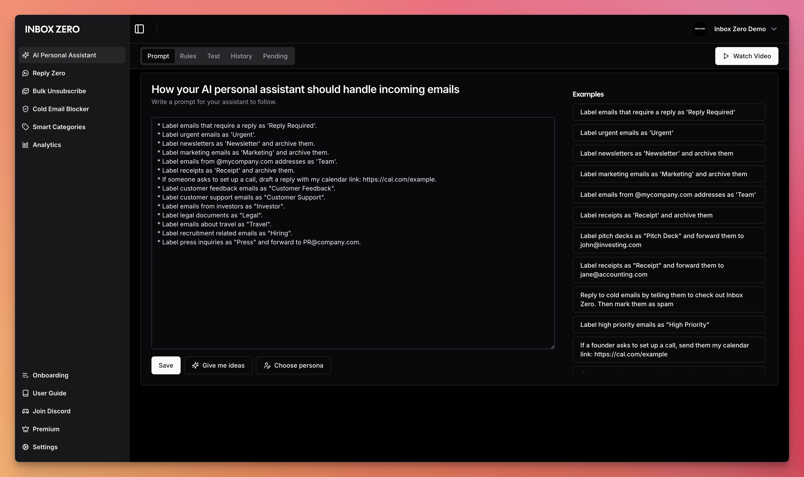
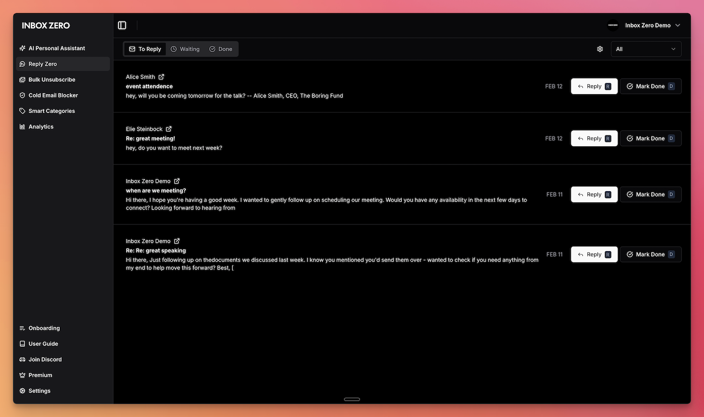
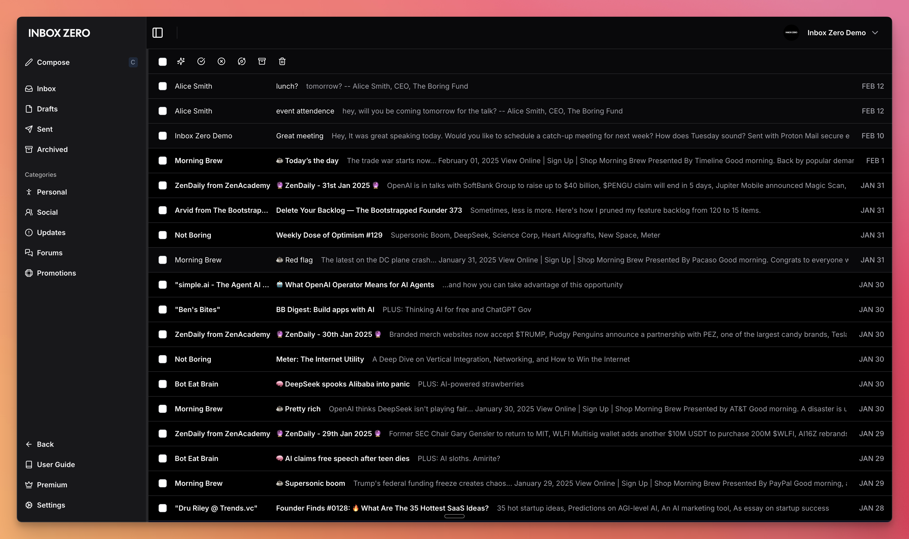
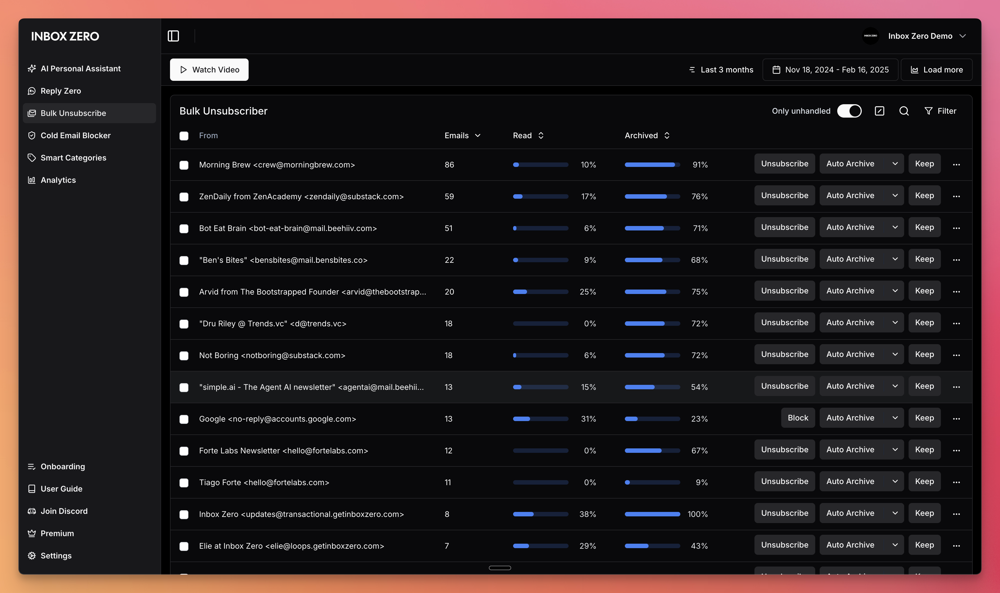

[](https://www.getinboxzero.com)

<p align="center">
  <a href="https://www.getinboxzero.com">
    <h1 align="center">Inbox Zero - your 24/7 AI email assistant</h1>
  </a>
  <p align="center">
    Organizes your inbox, pre-drafts replies, manages your calendar, and organizes attachments. Chat with it from Slack or Telegram to manage your inbox on the go. Open source alternative to Fyxer, but more customizable and secure.
    <br />
    <a href="https://www.getinboxzero.com">Website</a>
    ·
    <a href="https://www.getinboxzero.com/discord">Discord</a>
    ·
    <a href="https://github.com/elie222/inbox-zero/issues">Issues</a>
  </p>
</p>

> **This fork adds generic IMAP/SMTP support.** Connect any standard email account (Amazon WorkMail, Fastmail, Yahoo, iCloud, self-hosted Dovecot/Postfix, and more) with the full AI assistant experience. No Google or Microsoft account required - sign up with email/password and add your IMAP mailbox. See the [IMAP setup guide](#imap-setup) below.

<div align="center">


<a href="https://trendshift.io/repositories/6400" target="_blank"></a>

[](https://vercel.com/oss)

</div>

## Mission

To help you spend less time in your inbox, so you can focus on what matters most.

## Features

- **IMAP/SMTP Support:** Connect any standard IMAP mailbox - Amazon WorkMail, Fastmail, Yahoo, iCloud, ProtonMail Bridge, self-hosted servers. No Google or Microsoft account needed.
- **AI Personal Assistant:** Organizes your inbox and pre-drafts replies in your tone and style.
- **Cursor Rules for email:** Explain in plain English how your AI should handle your inbox.
- **Reply Zero:** Track emails to reply to and those awaiting responses.
- **Bulk Unsubscriber:** One-click unsubscribe and archive emails you never read.
- **Bulk Archiver:** Clean up your inbox by bulk archiving old emails.
- **Cold Email Blocker:** Auto‑block cold emails.
- **Email Analytics:** Track your activity and trends over time.
- **Meeting Briefs:** Get personalized briefings before every meeting, pulling context from your email and calendar.
- **Smart Filing:** Automatically save email attachments to Google Drive or OneDrive.
- **Slack & Telegram Integration:** Chat with your AI assistant from Slack or Telegram to manage your inbox without leaving the apps you already use.


Learn more in our [docs](https://docs.getinboxzero.com).

### Cursor plugin (API CLI)

This repo is packaged as a [Cursor plugin](https://cursor.com/docs/reference/plugins) (`.cursor-plugin/plugin.json`): install from the directory to use the **inbox-zero-api** skill and agent. Skill source lives in [`clawhub/inbox-zero-api`](clawhub/inbox-zero-api) (same as OpenClaw); `skills/inbox-zero-api` is a symlink for discovery. Requires [`@inbox-zero/api`](https://www.getinboxzero.com/api-reference/cli); set `INBOX_ZERO_API_KEY` for authenticated CLI commands (e.g. rules, stats). `openapi --json` does not need a key.

## Feature Screenshots

|  |                |
| :------------------------------------------------------: | :-------------------------------------------------------------: |
|                      _AI Assistant_                      |                          _Reply Zero_                           |
|     |  |
|                      _Gmail client_                      |                       _Bulk Unsubscriber_                       |

## Demo Video

[](http://www.youtube.com/watch?v=hfvKvTHBjG0)

## Built with

- [Next.js](https://nextjs.org/)
- [Tailwind CSS](https://tailwindcss.com/)
- [shadcn/ui](https://ui.shadcn.com/)
- [Prisma](https://www.prisma.io/)
- [Upstash](https://upstash.com/)
- [Turborepo](https://turbo.build/)
- [Popsy Illustrations](https://popsy.co/)

## Star History

[](https://www.star-history.com/#elie222/inbox-zero&Date)

## IMAP Setup

This fork lets you use Inbox Zero with any standard IMAP/SMTP email provider.

### Quick Start

1. **Sign up** with email and password on the login page (no Google/Microsoft account needed)
2. Go to **Accounts** and click **Add IMAP Account**
3. Select a **provider preset** (Amazon WorkMail, Fastmail, Yahoo, iCloud, ProtonMail Bridge) or enter your server details manually
4. Click **Test Connection** to verify IMAP and SMTP connectivity
5. Click **Add Account** - you're ready to go

### Supported Providers

| Provider | IMAP Host | IMAP Port | SMTP Host | SMTP Port |
|----------|-----------|-----------|-----------|-----------|
| Amazon WorkMail (us-east-1) | imap.mail.us-east-1.awsapps.com | 993 (TLS) | smtp.mail.us-east-1.awsapps.com | 465 (TLS) |
| Amazon WorkMail (eu-west-1) | imap.mail.eu-west-1.awsapps.com | 993 (TLS) | smtp.mail.eu-west-1.awsapps.com | 465 (TLS) |
| Fastmail | imap.fastmail.com | 993 (TLS) | smtp.fastmail.com | 465 (TLS) |
| Yahoo Mail | imap.mail.yahoo.com | 993 (TLS) | smtp.mail.yahoo.com | 465 (TLS) |
| iCloud Mail | imap.mail.me.com | 993 (TLS) | smtp.mail.me.com | 587 (STARTTLS) |
| ProtonMail Bridge | 127.0.0.1 | 1143 (STARTTLS) | 127.0.0.1 | 1025 (STARTTLS) |

Any IMAP/SMTP server works - these are just presets for convenience. Use an **app-specific password** when your provider supports it.

### New Email Notifications

IMAP doesn't support push notifications like Gmail or Outlook. Set up a cron job to poll for new messages:

```bash
# Poll every 3 minutes
*/3 * * * * curl -X POST http://localhost:3000/api/imap/poll -H "Authorization: Bearer $CRON_SECRET"
```

### Database Migration

After deploying this fork, run the migration to add the IMAP credentials table:

```bash
cd apps/web && npx prisma migrate dev --name add-imap-credentials
```

### What Works

All core features work with IMAP accounts: AI assistant, inbox management, send/reply/forward, archive, trash, folder management, bulk operations, and rules with folder-based actions.

Server-side email filters and calendar/drive integrations are not available for IMAP accounts (they require provider-specific APIs).

## Feature Requests

To request a feature open a [GitHub issue](https://github.com/elie222/inbox-zero/issues), or join our [Discord](https://www.getinboxzero.com/discord).

## Getting Started

We offer a hosted version of Inbox Zero at [getinboxzero.com](https://www.getinboxzero.com).

### Self-Hosting

The fastest way to self-host Inbox Zero is with the CLI:

> **Prerequisites**: [Docker](https://docs.docker.com/engine/install/) and [Node.js](https://nodejs.org/) v24+

```bash
npx @inbox-zero/cli setup      # One-time setup wizard
npx @inbox-zero/cli start      # Start containers
```

Open http://localhost:3000

For complete self-hosting instructions, production deployment, OAuth setup, and configuration options, see our **[Self-Hosting Docs](https://docs.getinboxzero.com/hosting/quick-start)**.

### Local Development

> **Prerequisites**: [Docker](https://docs.docker.com/engine/install/), [Node.js](https://nodejs.org/) v24+, and [pnpm](https://pnpm.io/) v10+

```bash
git clone https://github.com/elie222/inbox-zero.git
cd inbox-zero
docker compose -f docker-compose.dev.yml up -d   # Postgres + Redis
pnpm install
npm run setup                                     # Interactive env setup
cd apps/web && pnpm prisma migrate dev && cd ../..
pnpm dev
```

Open http://localhost:3000

After `pnpm install`, if you want to use the local Google emulator, start it with:

```bash
docker compose -f docker-compose.dev.yml --profile google-emulator up -d
```

Then point `apps/web/.env` at it with:

```bash
GOOGLE_BASE_URL=http://localhost:4002
GOOGLE_CLIENT_ID=emulate-google-client.apps.googleusercontent.com
GOOGLE_CLIENT_SECRET=emulate-google-secret
```

If you want to use the local Microsoft emulator, start it with:

```bash
docker compose -f docker-compose.dev.yml --profile microsoft-emulator up -d
```

Then point `apps/web/.env` at it with:

```bash
MICROSOFT_BASE_URL=http://localhost:4003
MICROSOFT_CLIENT_ID=emulate-microsoft-client-id
MICROSOFT_CLIENT_SECRET=emulate-microsoft-secret
```

See the **[Contributing Guide](https://docs.getinboxzero.com/contributing)** for more details including devcontainer setup.

## Contributing

View open tasks in [GitHub Issues](https://github.com/elie222/inbox-zero/issues) and join our [Discord](https://www.getinboxzero.com/discord) to discuss what's being worked on.

Docker images are automatically built on every push to `main` and tagged with the commit SHA (e.g., `elie222/inbox-zero:abc1234`). The `latest` tag always points to the most recent main build. Formal releases use version tags (e.g., `v2.26.0`).
