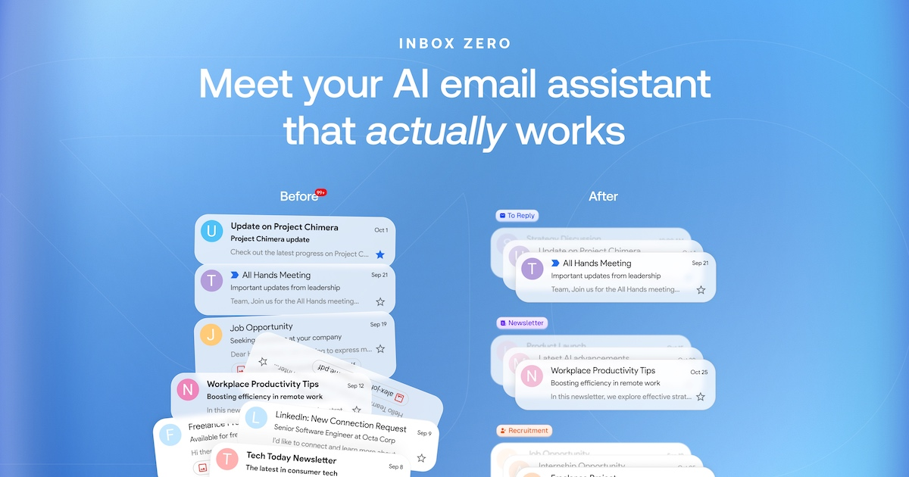
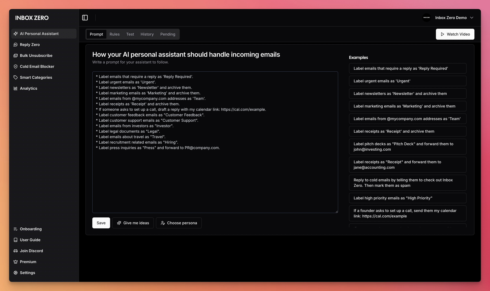
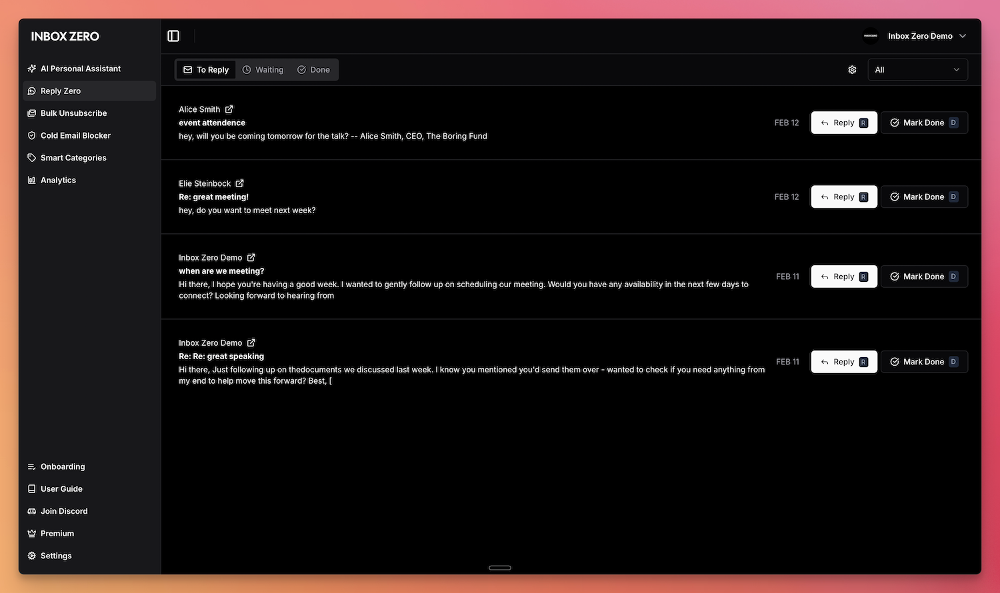
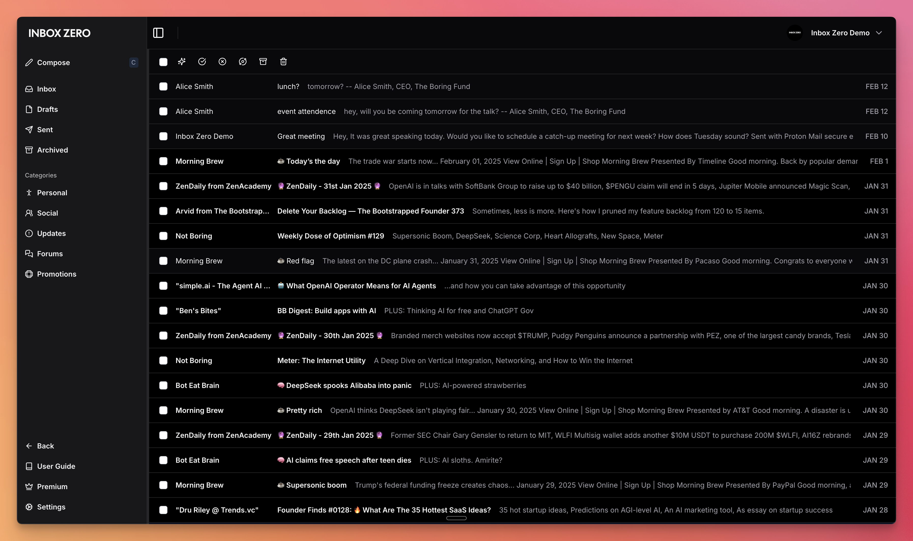
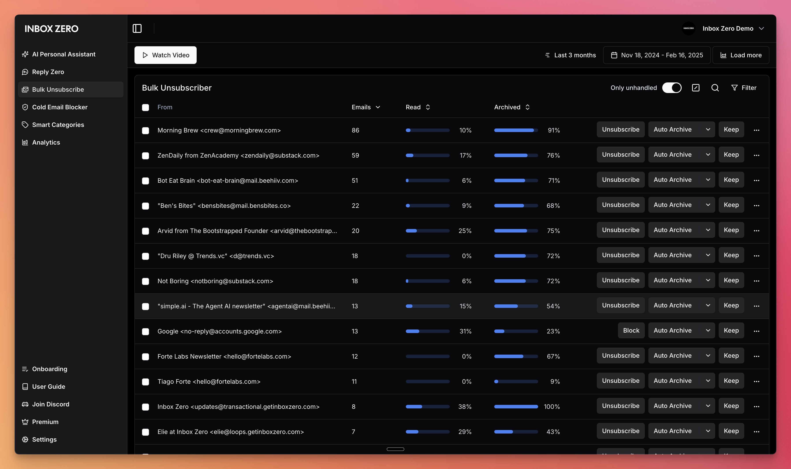

[](https://www.getinboxzero.com)

<p align="center">
  <a href="https://www.getinboxzero.com">
    <h1 align="center">Inbox Zero - your 24/7 AI email assistant</h1>
  </a>
  <p align="center">
    Organizes your inbox, pre-drafts replies, manages your calendar, and organizes attachments. Chat with it from Slack or Telegram to manage your inbox on the go. Open source alternative to Fyxer, but more customizable and secure.
    <br />
    <a href="https://www.getinboxzero.com">Website</a>
    ·
    <a href="https://www.getinboxzero.com/discord">Discord</a>
    ·
    <a href="https://github.com/elie222/inbox-zero/issues">Issues</a>
  </p>
</p>

<div align="center">


<a href="https://trendshift.io/repositories/6400" target="_blank"></a>

[](https://readme.cash/c/hg3bchcqpo)

[](https://vercel.com/oss)

</div>

## Mission

To help you spend less time in your inbox, so you can focus on what matters most.

## Features

- **AI Personal Assistant:** Organizes your inbox and pre-drafts replies in your tone and style.
- **AI Rules for email:** Explain in plain English how your AI should handle your inbox.
- **Reply Zero:** Track emails to reply to and those awaiting responses.
- **Bulk Unsubscriber:** One-click unsubscribe and archive emails you never read.
- **Bulk Archiver:** Clean up your inbox by bulk archiving old emails.
- **Cold Email Blocker:** Auto‑block cold emails.
- **Email Analytics:** Track your activity and trends over time.
- **Meeting Briefs:** Get personalized briefings before every meeting, pulling context from your email and calendar.
- **Smart Filing:** Automatically save email attachments to Google Drive or OneDrive.
- **Slack & Telegram Integration:** Chat with your AI assistant from Slack or Telegram to manage your inbox without leaving the apps you already use.


Learn more in our [docs](https://docs.getinboxzero.com).

## Feature Screenshots

|  |                |
| :------------------------------------------------------: | :-------------------------------------------------------------: |
|                      _AI Assistant_                      |                          _Reply Zero_                           |
|     |  |
|                      _Gmail client_                      |                       _Bulk Unsubscriber_                       |

## Demo Video

[](https://youtu.be/UusnveLKwWM)

## Built with

- [Next.js](https://nextjs.org/)
- [Tailwind CSS](https://tailwindcss.com/)
- [shadcn/ui](https://ui.shadcn.com/)
- [Prisma](https://www.prisma.io/)
- [Upstash](https://upstash.com/)
- [Turborepo](https://turbo.build/)
- [Popsy Illustrations](https://popsy.co/)

## Star History

[](https://www.star-history.com/#elie222/inbox-zero&Date)

## Feature Requests

To request a feature open a [GitHub issue](https://github.com/elie222/inbox-zero/issues), or join our [Discord](https://www.getinboxzero.com/discord).

## Getting Started

We offer a hosted version of Inbox Zero at [getinboxzero.com](https://www.getinboxzero.com).

### Self-Hosting

The fastest way to self-host Inbox Zero is with the CLI:

> **Prerequisites**: [Docker](https://docs.docker.com/engine/install/) and [Node.js](https://nodejs.org/) v24+

```bash
npx @inbox-zero/cli setup      # One-time setup wizard
npx @inbox-zero/cli start      # Start containers
```

Open http://localhost:3000

For complete self-hosting instructions, production deployment, OAuth setup, and configuration options, see our **[Self-Hosting Docs](https://docs.getinboxzero.com/hosting/quick-start)**.

### Local Development

> **Prerequisites**: macOS or Linux (WSL on Windows), [Node.js](https://nodejs.org/) v24, and the pnpm version pinned in `package.json`. Install either [Docker Desktop](https://docs.docker.com/desktop/) with Compose or native PostgreSQL and Redis. On macOS, native services can be installed with `brew install postgresql@16 redis`.

```bash
git clone https://github.com/elie222/inbox-zero.git
cd inbox-zero
pnpm install
pnpm local:start
```

Open http://localhost:3000/mail and sign in with Google as `developer@example.com`, or Microsoft as `developer@outlook.test`. The Google mailbox contains demo messages. Demo users have onboarding completed, and premium checks are bypassed for local development.

The command starts an isolated database, Redis and its HTTP endpoint, both mail-provider emulators, billing and email-delivery emulators, an LLM emulator, and Next.js. It applies migrations and waits for services to become ready. No OAuth credentials or AI API keys are required. AI responses are canned; this mode exercises application flows, not model quality.

Existing `.env` files are left unchanged and ignored by this launcher. Generated credentials, seed data, and the current service addresses are stored under `.context/local-dev/`. Native database data stays there; Docker database data stays in a volume unique to the checkout. Restarts preserve database data and credentials. Redis caches and provider/emulator state start fresh on each run.

Press **Ctrl-C** to stop the app and the services this command started. Start it again with the same command. If port 3000 is occupied, use `pnpm local:start --port 3001`. Native PostgreSQL and Redis are selected when available; use `--backend docker` or `--backend native` to select explicitly. A checkout-specific loopback port prevents concurrent launchers; the operating system releases that lock after a crash, and stale PID files are replaced automatically. Services use automatically assigned ports, so existing databases and Redis instances are not reused or stopped.

Run `pnpm local:start --help` for options. If an unrelated process occupies the reported lock port, stop that process or use a different checkout location. PostgreSQL data must be opened with the same major version that created it. If you upgrade your native PostgreSQL major version, back up or move `.context/local-dev/postgres` before starting a new cluster.

For development against real providers, continue to use `pnpm setup`, your own environment files, and `pnpm dev`. See the **[Contributing Guide](https://docs.getinboxzero.com/contributing)** for configuration and devcontainer setup.

## Contributing

View open tasks in [GitHub Issues](https://github.com/elie222/inbox-zero/issues) and join our [Discord](https://www.getinboxzero.com/discord) to discuss what's being worked on.

Docker images are automatically built on every push to `main` and tagged with the commit SHA (e.g., `elie222/inbox-zero:abc1234`). The `latest` tag always points to the most recent main build. Formal releases use version tags (e.g., `v2.26.0`).
