# 📧 Inbox Zero Digest System - Complete Guide

Welcome to the Inbox Zero digest system! This is a sophisticated email summarization and batching system that helps users manage inbox overload by converting individual emails into periodic summary emails. Let me walk you through how it all works.

## 🎯 What is the Digest System?

The digest system is designed to solve inbox overload by:

- **Batching emails** into periodic summary emails instead of individual notifications
- **AI-powered summarization** that extracts key information from emails
- **Smart categorization** that groups similar content together  
- **Flexible scheduling** that respects user preferences for timing and frequency
- **Cold email handling** without blocking them entirely

## 🏗️ System Architecture

### Core Components

1. **Email Processing Pipeline** - Handles incoming emails and determines if they should go to digest
2. **AI Summarization Engine** - Uses LLMs to extract meaningful content from emails
3. **Storage & Batching System** - Stores summaries and groups them into digest batches
4. **Scheduling System** - Manages when digest emails are sent
5. **Email Generation** - Creates beautiful HTML digest emails
6. **Cron Job System** - Triggers digest sending based on user schedules

## 🔄 Complete Flow Diagram

```mermaid
graph TD
    A["📧 Email Arrives"] --> B{"Rule Matches?"}
    B -->|"Yes"| C["📋 DIGEST Action"]
    B -->|"Cold Email"| D["🔍 Cold Email Detector"]
    C --> E["📤 enqueueDigestItem"]
    D -->|"coldEmailDigest=true"| E
    E --> F["⚡ QStash Queue"]
    F --> G["🤖 AI Summarization"]
    G --> H["💾 upsertDigest"]
    H --> I["🗄️ Store in Database"]
    
    J["⏰ Cron Job"] --> K["📅 Check Schedules"]
    K --> L["👥 Find Due Users"]
    L --> M["📧 Send Digest Email"]
    M --> N["✅ Mark as SENT"]
    N --> O["🔒 Redact Content"]
    
    style A fill:#e1f5fe,stroke:#01579b,stroke-width:2px,color:#000
    style B fill:#fff3e0,stroke:#e65100,stroke-width:2px,color:#000
    style C fill:#f3e5f5,stroke:#4a148c,stroke-width:2px,color:#000
    style D fill:#e8f5e8,stroke:#1b5e20,stroke-width:2px,color:#000
    style E fill:#fff8e1,stroke:#f57f17,stroke-width:2px,color:#000
    style F fill:#e3f2fd,stroke:#0d47a1,stroke-width:2px,color:#000
    style G fill:#fce4ec,stroke:#880e4f,stroke-width:2px,color:#000
    style H fill:#f1f8e9,stroke:#33691e,stroke-width:2px,color:#000
    style I fill:#e0f2f1,stroke:#004d40,stroke-width:2px,color:#000
    style J fill:#fff3e0,stroke:#e65100,stroke-width:2px,color:#000
    style K fill:#f3e5f5,stroke:#4a148c,stroke-width:2px,color:#000
    style L fill:#e8f5e8,stroke:#1b5e20,stroke-width:2px,color:#000
    style M fill:#e1f5fe,stroke:#01579b,stroke-width:2px,color:#000
    style N fill:#e8f5e8,stroke:#1b5e20,stroke-width:2px,color:#000
    style O fill:#ffebee,stroke:#b71c1c,stroke-width:2px,color:#000
```




## 📊 Database Schema

### Core Tables

```prisma
model Digest {
  id             String       @id @default(cuid())
  emailAccountId String
  items          DigestItem[]
  sentAt         DateTime?
  status         DigestStatus @default(PENDING)
}

model DigestItem {
  id          String          @id @default(cuid())
  messageId   String
  threadId    String
  content     String          @db.Text  // JSON summary
  digestId    String
  actionId    String?         // Link to rule action
  coldEmailId String?         // Link to cold email
}

model Schedule {
  id                String   @id @default(cuid())
  intervalDays      Int?     // Total interval in days
  occurrences       Int?     // Number of times within interval
  daysOfWeek        Int?     // Bit mask for days (0-127)
  timeOfDay         DateTime? // Canonical time (1970-01-01)
  emailAccountId    String
  lastOccurrenceAt  DateTime?
  nextOccurrenceAt  DateTime?
}

enum DigestStatus {
  PENDING     // Accumulating items
  PROCESSING  // Being sent
  SENT        // Completed
  FAILED      // Error occurred
}
```

## 🚀 How Emails Enter the Digest System

### 1. Rule-Based Triggers

Users can create rules that trigger `DIGEST` actions:

```typescript
// Example rule configuration
{
  name: "Newsletter Digest",
  actions: [
    {
      type: "DIGEST" as const,
      // Rule name becomes the category
    }
  ]
}
```

### 2. Cold Email Detection

When cold emails are detected and `coldEmailDigest: true`:

```typescript
if (isColdEmail && user.coldEmailDigest) {
  await enqueueDigestItem({ 
    email, 
    emailAccountId, 
    coldEmailId 
  });
  // Email goes to digest instead of being blocked
}
```

## 🤖 AI Summarization Pipeline

### The AI Prompt Strategy

The system uses sophisticated prompts tailored to different email categories:

```typescript
const system = `You are an AI assistant that processes emails for inclusion in a daily digest.
Your task is to summarize the content accordingly using the provided schema.

Guidelines for summarizing the email:
- If the email is spam, promotional, or irrelevant, return "null".
- Do NOT mention the sender's name or start with phrases like "This is a message from X"
- DO NOT use meta-commentary like "highlights", "discusses", "reflects on"
- Lead with the most interesting or important point
- Be engaging and direct - write like you're telling someone the key points
- When there are multiple items, use newlines to separate them
- DO NOT include bullet point characters (•, -, *, etc.)
`;
```

### Output Formats

**Structured Data** (receipts, orders, events):
```typescript
{
  entries: [
    { label: "Order Number", value: "#12345" },
    { label: "Total", value: "$99.99" },
    { label: "Delivery", value: "March 15" }
  ]
}
```

**Unstructured Summarization** (newsletters, notes):
```typescript
{
  content: "Simple habit tracker app makes $30K/month despite thousands of competitors. Key lesson: stop overthinking and just build. AI tools now let anyone create apps without coding."
}
```

## 📧 Email Template System

### Categories & Colors

The digest email template supports these categories with distinct color schemes:

```typescript
const categoryColors = {
  newsletter: "blue",    // Publications, blogs
  receipt: "green",     // Orders, invoices, payments  
  marketing: "purple",  // Promotional content
  calendar: "amber",    // Events, meetings
  coldEmail: "gray",    // Unsolicited emails
  notification: "pink", // System alerts
  toReply: "red"        // Action required
};
```

### Email Structure

Each digest email contains:
- **Header** with Inbox Zero branding
- **Categorized sections** with color-coded content
- **Individual email summaries** with sender info
- **Footer** with unsubscribe and settings links

## ⏰ Scheduling System

### Schedule Configuration

Users can configure:
- **Frequency**: Daily, weekly, or custom intervals
- **Time**: Specific time of day
- **Days**: Specific days of the week (using bitmasks)

```typescript
// Example: Daily at 11 AM
{
  intervalDays: 1,
  timeOfDay: "11:00",
  occurrences: 1,
  daysOfWeek: null // Every day
}

// Example: Twice weekly on Mon/Wed
{
  intervalDays: 7,
  timeOfDay: "09:00", 
  occurrences: 2,
  daysOfWeek: 0b0101000 // Monday (bit 5) | Wednesday (bit 3)
}
```

### Schedule Calculation

The system uses sophisticated logic to calculate next occurrence dates:

```typescript
export function calculateNextScheduleDate(frequency: Schedule): Date | null {
  // Handles:
  // - Simple intervals (every 7 days)
  // - Multiple occurrences (3 times per week)
  // - Specific days (Mondays and Fridays)
  // - Time of day considerations
}
```

## 🔄 Cron Job System

### Digest Triggering

A cron job runs periodically to check for users due for digest emails:

```typescript
// GET /api/resend/digest/all
async function sendDigestAllUpdate() {
  const now = new Date();
  
  // Get all email accounts that are due for a digest
  const emailAccounts = await prisma.emailAccount.findMany({
    where: {
      digestSchedule: {
        nextOccurrenceAt: { lte: now },
      },
      // Only send to premium users
      user: {
        premium: {
          OR: [
            { lemonSqueezyRenewsAt: { gt: now } },
            { stripeSubscriptionStatus: { in: ["active", "trialing"] } },
          ],
        },
      },
    },
  });
  
  // Queue individual digest jobs
  for (const emailAccount of emailAccounts) {
    await publishToQstashQueue({
      queueName: "email-digest-all",
      url: "/api/resend/digest",
      body: { emailAccountId: emailAccount.id },
    });
  }
}
```

## 🎛️ User Settings & Configuration

### Digest Settings Form

Users can configure:
- **What to include**: Select which rules and cold emails to digest
- **Schedule**: When to send digest emails
- **Preview**: Live preview of digest email format

```typescript
// Settings are stored in:
// - EmailAccount.coldEmailDigest (boolean)
// - Rule actions with type: "DIGEST"
// - Schedule table with timing preferences
```

## 🔧 Key API Endpoints

| Endpoint | Purpose | Trigger |
|----------|---------|---------|
| `POST /api/ai/digest` | Process single digest item | QStash queue |
| `POST /api/resend/digest` | Send digest email | QStash queue |
| `POST /api/resend/digest/all` | Trigger batch sending | Cron job |
| `GET /api/digest-preview` | Preview digest format | UI |

## 🛡️ Security & Privacy

### Content Redaction

After sending, digest content is redacted for privacy:

```typescript
// After successful email sending
await prisma.digestItem.updateMany({
  data: { content: "[REDACTED]" },
  where: {
    digestId: { in: processedDigestIds },
  },
});
```

### Cron Security

All cron endpoints are protected with secrets:

```typescript
export const GET = withError(async (request) => {
  if (!hasCronSecret(request)) {
    captureException(new Error("Unauthorized cron request"));
    return new Response("Unauthorized", { status: 401 });
  }
  // ... cron logic
});
```

## 🧪 Testing

The system includes comprehensive tests for AI summarization:

```typescript
// Test different email categories
test("summarizes newsletter about building apps", async () => {
  const result = await aiSummarizeEmailForDigest({
    ruleName: "newsletter",
    emailAccount,
    messageToSummarize: newsletterEmail,
  });
  
  expect(result?.content).toContain("30k");
  expect(result?.content).toContain("habit");
});
```

## 🚀 Revamping Opportunities

Based on my analysis, here are key areas where you could revamp the digest system:

### 1. **AI Prompts & Logic**
- **Current**: Single prompt for all categories
- **Opportunity**: Category-specific prompts with different summarization strategies
- **Enhancement**: Multi-step summarization (extract → categorize → summarize)

### 2. **Email Template & Design**
- **Current**: Basic color-coded sections
- **Opportunity**: Rich, interactive digest emails with:
  - Interactive elements (buttons, links)
  - Better visual hierarchy
  - Mobile-optimized design
  - Personalization based on user preferences

### 3. **Scheduling & Triggers**
- **Current**: Simple time-based scheduling
- **Opportunity**: Smart triggers based on:
  - Email volume thresholds
  - User activity patterns
  - Content urgency detection
  - Adaptive scheduling

### 4. **Content Processing**
- **Current**: Basic categorization
- **Opportunity**: Advanced content analysis:
  - Sentiment analysis
  - Priority scoring
  - Cross-email pattern detection
  - Smart grouping beyond rule categories

### 5. **User Experience**
- **Current**: Static settings form
- **Opportunity**: Dynamic configuration:
  - A/B testing different digest formats
  - User feedback integration
  - Smart defaults based on email patterns
  - Digest analytics and insights

Would you like me to dive deeper into any of these areas or help you plan specific improvements to the digest system?