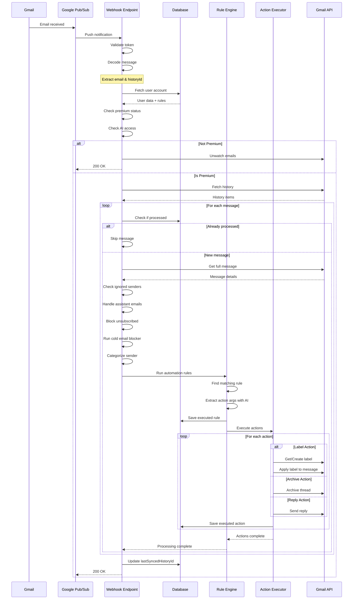
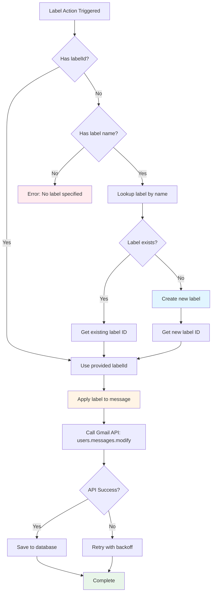
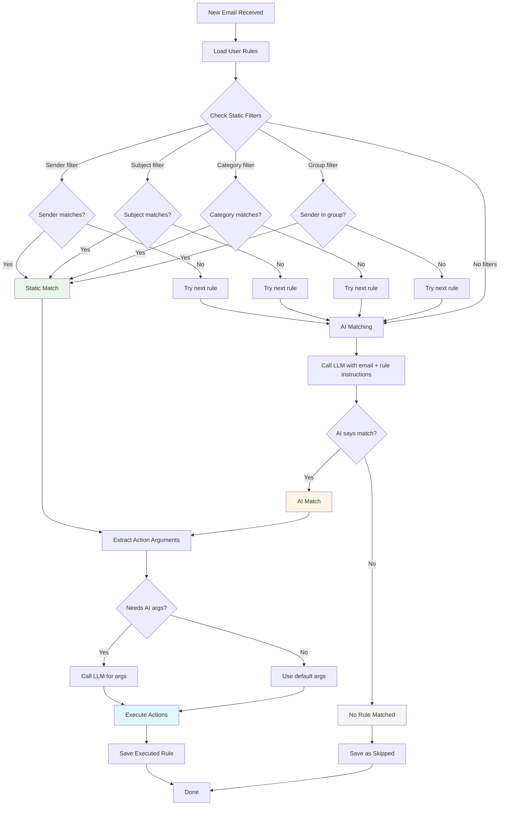
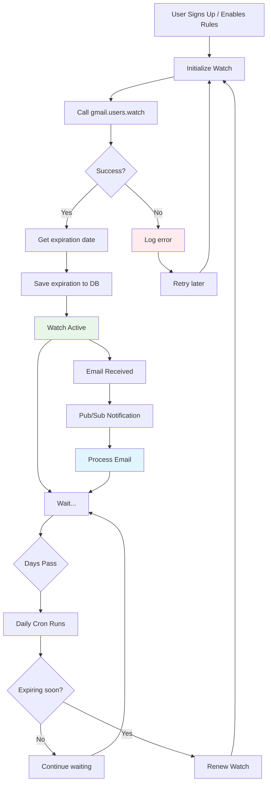
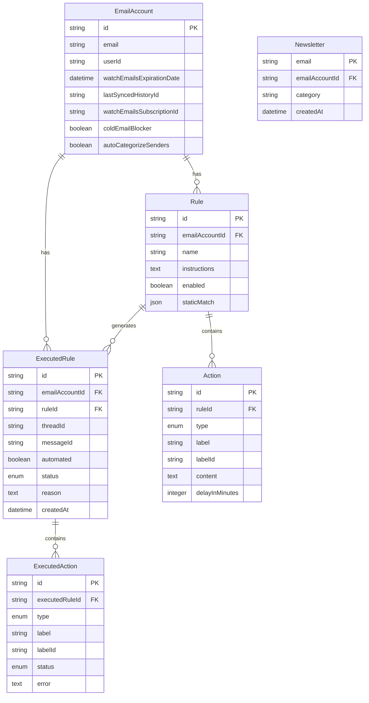
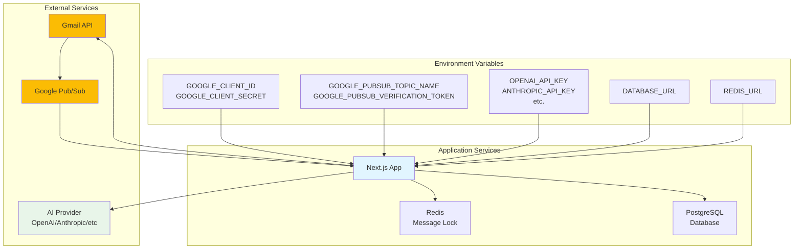
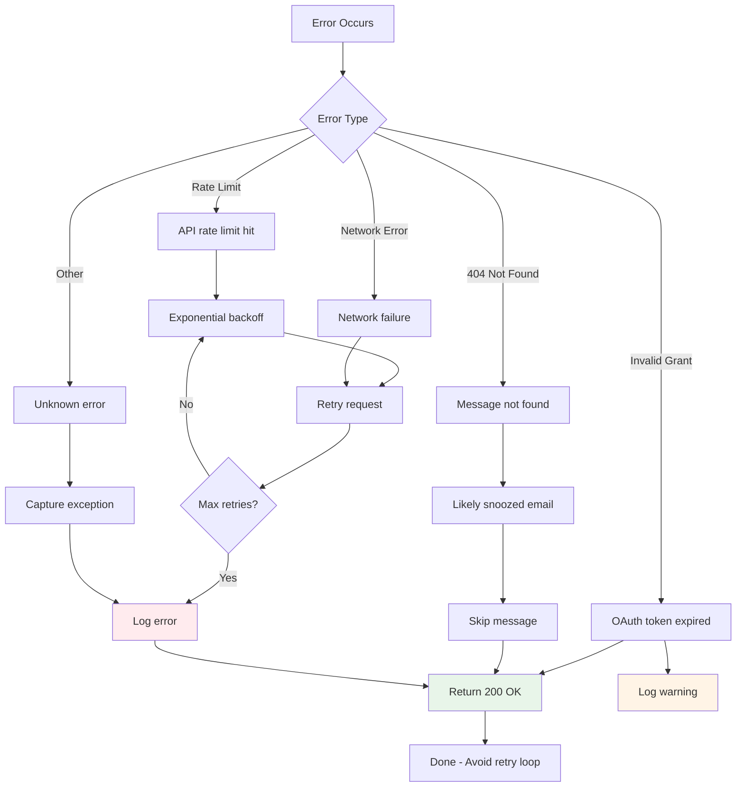
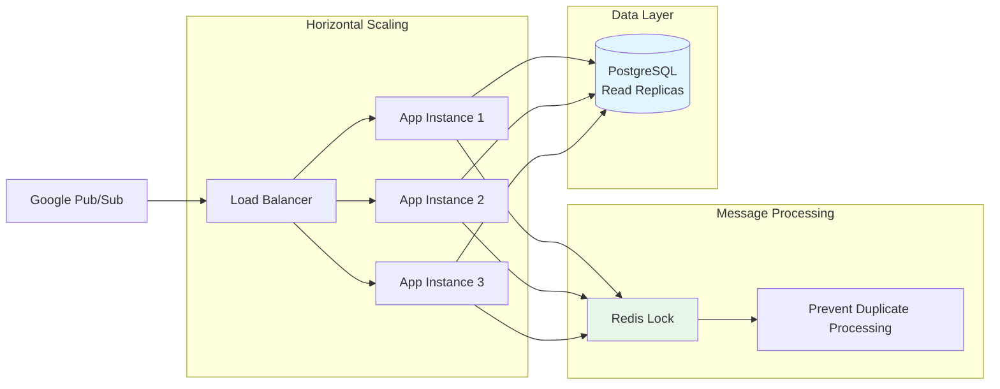

# Google Pub/Sub Architecture & Flow Diagrams

Visual representations of how Google Pub/Sub and automatic email labeling work in Inbox Zero.

## Overall Architecture

```mermaid
graph TB
    Gmail[Gmail] --> PubSub[Google Pub/Sub Topic]
    PubSub --> Subscription[Push Subscription]
    Subscription --> Webhook[/api/google/webhook]
    Webhook --> Validate{Verify Token}
    Validate -->|Invalid| Reject[403 Forbidden]
    Validate -->|Valid| Process[Process History]
    
    Process --> FetchUser[Fetch User Account]
    FetchUser --> CheckPremium{Is Premium?}
    CheckPremium -->|No| Unwatch[Unwatch Emails]
    CheckPremium -->|Yes| CheckRules{Has Rules?}
    
    CheckRules -->|No| Skip[Skip Processing]
    CheckRules -->|Yes| FetchHistory[Fetch Gmail History]
    
    FetchHistory --> ProcessMessages[Process Each Message]
    ProcessMessages --> RunRules[Run Automation Rules]
    RunRules --> ExecuteActions[Execute Actions]
    
    ExecuteActions --> Label[Apply Labels]
    ExecuteActions --> Archive[Archive Threads]
    ExecuteActions --> Reply[Send Replies]
    ExecuteActions --> Other[Other Actions]
    
    Label --> UpdateGmail[Update Gmail via API]
    Archive --> UpdateGmail
    Reply --> UpdateGmail
    Other --> UpdateGmail
    
    UpdateGmail --> SaveDB[Save to Database]
    SaveDB --> Done[Complete]
```

## Detailed Message Processing Flow



## Label Action Flow



## Rule Matching Process



## Watch Management Flow



## Database Schema (Relevant Tables)



## Environment & Service Dependencies



## Error Handling Flow



## System Health Monitoring

Key metrics to monitor:

1. **Pub/Sub Metrics**
   - Message publish rate
   - Message acknowledgment rate
   - Unacknowledged message count
   - Subscription delivery latency

2. **Application Metrics**
   - Webhook response time
   - Rule execution time
   - Action success rate
   - Error rate by type

3. **Database Metrics**
   - ExecutedRule creation rate
   - ExecutedAction success rate
   - Watch expiration alerts

4. **Gmail API Metrics**
   - API quota usage
   - Rate limit hits
   - Token refresh rate

## Scalability Considerations



## Performance Optimizations

1. **Redis Locking** - Prevents duplicate processing of same message
2. **Batch Processing** - Processes multiple history items together
3. **Parallel Execution** - Runs multiple actions concurrently
4. **History Limiting** - Limits lookback to avoid processing too many messages
5. **Async Operations** - Uses `after()` for non-critical operations
6. **Database Indexes** - On messageId, threadId, emailAccountId
7. **Caching** - Caches label lookups and user settings

## Security Measures

1. **Token Verification** - Webhook validates token before processing
2. **OAuth Encryption** - Access/refresh tokens encrypted in database
3. **User Isolation** - Users can only access their own data
4. **Rate Limiting** - Prevents abuse of API endpoints
5. **Premium Checks** - Features gated behind premium subscription
6. **Input Validation** - Validates all inputs with Zod schemas

