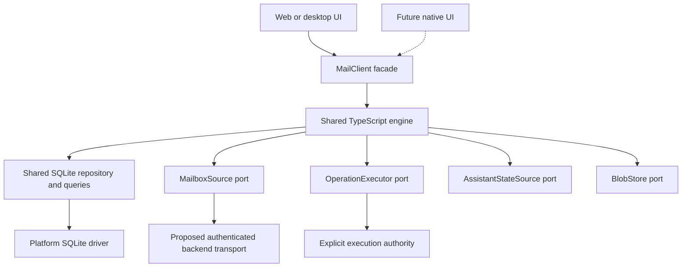

# Shared mail engine: implementation plan

Build a fast, consistent web/Electron mail client around a shared SQLite engine while preserving the always-on server assistant. This is the single design and implementation reference.

The design is proposed until the implementation prompt is executed. That prompt selects the initial existing-login/backend-mediated route and authorizes implementation and local verification. Material unresolved product/support decisions remain explicit gates; production rollout, merging, and AI prompt/tool changes are not implicitly authorized.

Read in order, then refer to the relevant section during implementation:

1. [Implementation approach](#approach): scope, simplicity, and replacement philosophy.
2. [Architecture](#architecture): ownership, consistency, sync, storage, stages, and acceptance matrix.
3. [Interfaces](#interfaces): typed boundaries and behavioral guarantees.
4. [Implementation map](#implementation-map): source layout, HTTP resources, transactions, worked flows, and decision gates.
5. [Review notes](#review-notes): independent review findings and corrections.

<a id="approach"></a>

## Implementation approach

Build the mail engine we would choose if the existing IndexedDB cache and mailbox synchronization code did not exist. Prioritize a small, understandable system with clear ownership, durable operations, and observable correctness. Web and Electron are the production scope. Keep portable TypeScript boundaries suitable for a later React Native/Expo inbox. Do not build speculative Swift support or migrate the current mobile app.

The existing code is a source of product behavior, provider discoveries, and regression examples. It is not the target architecture. Do not translate old stores into new tables, wrap old coordinators in new interfaces, or copy a large module and rename it. Do not preserve an internal abstraction solely because callers already use it.

Build a fresh engine beside the existing application, then replace complete mailbox flows. Reuse a small existing utility only when its responsibility, dependencies, semantics, and tests fit the new design better than a fresh implementation. Leave unrelated live assistant functionality operating correctly; this boundary is not a requirement to preserve defective mailbox internals.

### The small system we want

The design should remain explainable through five responsibilities:

1. **Mailbox state:** the latest accepted provider observations and the effective state shown to the user.
2. **Commands:** durable user intent, execution outcomes, and pending effects.
3. **Synchronization:** obtain provider changes, commit progress safely, and repair drift.
4. **Queries:** lists, splits, counts, readers, and search derived from the same state.
5. **Platform adapters:** database connection, transport/authentication, binary storage, and execution lifecycle.

These are responsibilities, not a mandate to create five classes or packages. Use plain modules/functions and explicit dependencies. Introduce interfaces at real platform, provider, persistence, or UI boundaries; do not create an interface for every internal function.

The proposed `mail-core`, `mail-sqlite`, and `mail-react` boundaries protect portability and ownership. Prove them with a working slice before expanding their APIs. Do not grow a framework around them.

At UI integration, `mail-ui` shares React DOM mail presentation between the Next route and the locally packaged desktop renderer. It is not a mobile dependency or an additional state owner. Platform authentication, navigation, and settings remain host responsibilities.

Core guarantees:

- A view cannot independently write message state. All views query the same effective model.
- An executable command and its pending effect commit together before queued success is reported to the UI. Incomplete conversation intent is durably reported as preparing without partial command effects; target freeze and the full pending effect commit together later.
- Sync progress and corresponding changes or required jobs commit together.
- An operation with an unknown provider outcome cannot be mistaken for a known failure or safely retryable action.
- Reconciliation recovers provider truth; old diagnostic history is not required for correctness.

Use types, schema constraints, uniqueness rules, and transaction boundaries to make violations difficult. Do not rely on comments telling every caller to remember extra invalidations.

### Begin with a runnable model, not a complete framework

Agree the concrete ingestion route with the product owner before broad implementation. The working proposal is existing product login and connected-account grants, with backend-mediated mail access for web and Electron. Bind the source port to fresh versioned HTTP resources and the executor to backend command handling. Demonstrate provider -> backend -> engine -> SQLite -> UI plus archive -> backend -> provider -> reconciliation against both existing provider emulators. Measure the baseline and present concerns for joint review; do not independently choose a different production route. A direct-fetch comparison is optional when a specific question warrants it, not a prerequisite.

Preserve a clean source/executor boundary so future native reads can use another adapter without rewriting mailbox state, queries, or UI. Do not build unused transports or an auth framework now. Keeping the product login does not eliminate provider-specific credential/consent work for direct access later, and changing reads does not automatically change send or assistant execution ownership. Emulators establish behavior; modeled latency and authorized live checks address performance/fidelity questions they cannot answer.

First demonstrate one account, two split queries, and one archive operation using real SQLite and a deterministic provider fixture:

1. Ingest a conversation and render both queries.
2. Admit archive durably and show consistent results in both queries and their counts.
3. Resolve success, definitive failure, and an uncertain response.
4. Restart between meaningful steps and recover without losing intent.
5. Receive a new message and a delayed old response; preserve the correct result.

This slice must establish the state/transaction/query model. Then test ownership across tabs/windows and provider-specific behavior. Add features by extending the same model, not by creating feature-specific caches and recovery loops.

The following sections describe requirements and candidate contracts. They are not an instruction to implement every illustrated interface, enum value, scheduler abstraction, or table in advance. If a contract becomes smaller while preserving a stated requirement, improve it and update this plan. Record material behavior/trust-boundary changes; ordinary internal simplifications do not need a new approval ceremony.

Keep the target design explicit, but let concrete examples disprove it early. No diagram or type signature establishes correctness on its own.

### Rules for adding complexity

For each new module, stored representation, persistent status, retry path, or public field, be able to explain:

- The required behavior or demonstrated failure it addresses.
- Why an existing owner cannot handle that responsibility more simply.
- Its lifecycle, including cleanup and recovery if it stores data.

Do not maintain a bureaucracy for every line of code. Apply these questions at design reviews and whenever a change adds another source of state or coordination.

Prefer one transaction or a stronger existing contract over another watcher, overlay, fallback, flag, or retry timer. If several callers need the same defensive fix, repair the shared owner or boundary. If a new exception makes a model substantially harder to explain, revise that model before piling on more exceptions.

Some complexity is unavoidable: providers differ, requests can succeed before responses are lost, and devices can stop running. Keep those facts contained in the responsible module. Do not make a screen or hook understand provider cursors, command settlement, and storage repair.

Avoid full event sourcing, generic event buses, dependency-injection containers, provider plugin frameworks, storage engines for hypothetical platforms, and configurable strategies with only one real use. A generic abstraction must earn its cost through actual consumers or a required boundary.

### How to handle AI and human review feedback

Review comments are hypotheses to investigate. Do not automatically implement every suggested guard, and do not dismiss a real correctness issue merely because it makes the change larger.

For a substantive comment:

1. State the failure sequence and the user-visible or integrity consequence. A provider guarantee, concrete code trace, or targeted failing test is useful evidence; not every rare failure can be reproduced live.
2. Identify the invariant and module that should own the fix.
3. Add or refine a focused behavioral test when it can catch the regression.
4. Fix the responsible model/transaction/boundary. Delete workarounds made unnecessary by the fix.
5. Rerun relevant tests and inspect whether the public API or number of state owners grew unnecessarily.

If the reported state is already impossible under an enforced contract, explain that contract and its evidence rather than adding another guard. If it is a hypothetical unsupported future feature, defer it explicitly. If the concern is valid but the proposed fix is convoluted, accept the concern and choose a simpler fix.

Do not optimize for a zero-comment review at the cost of clarity. Resolve high-impact correctness and data-loss issues; require concrete justification for extra machinery. This guidance concerns how to evaluate reviews, not an instruction to spawn reviewers automatically.

### Tests that protect the design

Maintain a small semantic reference model independent of production SQL/reconciliation code. Run meaningful generated command/observation sequences against both and compare effective state. Keep generation seeds so failures reproduce.

Use real SQLite adapter contract tests for transaction rollback, uniqueness, restart, and query semantics. Use provider fixtures/emulators for documented provider differences and targeted live checks where emulator behavior is insufficient. Verify the whole user flow across views, not just a mocked method call.

Test invariant families: one archive scenario should cover agreement across affected views; one stale-response rule should protect every ingestion path that shares that boundary. Add a separate case when the semantics actually differ, such as uncertain send versus safe-repeat metadata change.

Do not freeze incidental function names, module layouts, or private call order. Tests must permit simplification. Avoid exhaustive combinations of arbitrary flags that should not exist in the model at all. Follow repository testing instructions and practical TDD for correctness-sensitive work.

Self-testing is part of implementation ownership. Use the existing Gmail and Outlook emulators for the same semantic integration scenarios, real SQLite, and the actual UI/engine/provider paths. Independently inspect provider state, local committed state, and what the user sees. Extend the existing browser harness to Outlook and add desktop coverage rather than assuming Gmail browser success proves both. Inject network/crash/notification faults through test infrastructure, not production API parameters.

Run the scenarios, inspect screenshots/traces/console errors and structured results, fix the owning code, and rerun affected regressions. Finish with the required dual-provider matrix and publish exact commands, results, artifacts, and gaps. Writing tests or passing a suite with skipped scenarios is insufficient. Do not alter expected behavior, mock out the engine/store/provider path under test, or soften emulator semantics to obtain green results. The architecture plan's mandatory self-testing section defines the acceptance matrix and current infrastructure.

Preserve the always-on assistant: test its affected backend flows while the client is stopped and subsequent client catch-up. Deterministic LLM emulator responses prove integration, not AI quality. Report missing emulator/live-provider coverage honestly; do not claim exhaustive proof of correctness.

### Replacement and migration

Do not ship two mailbox state owners. During development, keep the new engine isolated behind a bounded integration seam; each account/profile has exactly one active command dispatcher. Switch a complete flow to the new engine, then remove its old cache/overlay/coordination path.

Before building migration machinery, determine whether any existing installation has irreplaceable local drafts, pending commands, uncertain sends, or attachment files. Disposable provider caches can be discarded and resynced. If there is no user work to preserve, skip an importer. If there is user work, preserve it with a focused restartable import outside the core. Do not silently erase it because the product is in beta.

The existing assistant and any installed-client contracts remain live product obligations where used. Internal implementations may be replaced, but do not break external behavior accidentally. A shared server helper can be reused or rewritten based on fit; its age or amount of existing code does not decide the architecture.

### What completion should look like

A developer implementing a new split writes a query definition. A developer adding an archive button submits a command. Neither writes cache invalidation, optimistic rollback, provider-specific branching, or synchronization logic.

A developer investigating a failure can identify the confirmed provider state, pending intent, execution evidence, and sync checkpoint in their owning modules. The system explains uncertainty rather than hiding it behind apparently successful UI.

Each implementation milestone should report the behavior demonstrated, tests run, old mechanisms removed, and remaining design decisions. The result should contain fewer independent concepts than the system it replaces, with the complexity that remains tied to real product or provider behavior.

<a id="architecture"></a>

## Architecture

### Design discipline

Preserve required behavior and user work, not current internal structures. Use existing code to discover provider constraints and regression scenarios; do not mechanically translate stores, wrappers, overlays, or coordinators. Build the new state/command/query model independently and replace complete flows. Reuse only code that clearly fits its new responsibility.

The detailed contracts and data concepts below are hypotheses to validate with a small runnable slice. They are not a checklist of abstractions to build upfront. Keep ownership and consistency guarantees firm while simplifying method names, statuses, tables, and layers when evidence supports a smaller model. Every material addition should address a real requirement or concrete failure sequence.

### 1. Decisions and remaining experiments

| Area | Proposed decision |
| --- | --- |
| Local source for mailbox UI | One normalized SQLite mailbox database per signed-in app profile, containing all connected accounts, with account-qualified identities |
| React state | Selection, navigation, transient editor interaction; mailbox records come from engine subscriptions |
| Consistency | Atomic local commits; durable pending commands; provider-aware reconciliation; eventual convergence with the provider |
| Event history | Small disposable diagnostic journal; no full event sourcing, blockchain, or historical replay requirement |
| Shared implementation | Portable TypeScript engine, shared SQL schema/repository, thin React bindings |
| Platform-specific implementation | Database drivers/ownership, credential handling, binary storage, lifecycle, IPC, notifications, rendering |
| Desktop | Electron; native SQLite outside renderer and main UI thread; locally bootable mail UI |
| Browser | SQLite WASM/OPFS behind a coordinated owner; explicit browser capability gate |
| Mobile | Native SQLite adapter; shared engine runs within OS execution windows |
| Assistant | Remains server-side and independent of an open client |
| Login and provider routing | Working proposal for joint review: existing product login and connected-account grants; backend-mediated mail access for web and Electron initially |
| Sending and scheduled work | One explicit execution authority per operation; retain durable server send/scheduling semantics unless a separately validated replacement is chosen |

SQLite is selected because it supports one relational mailbox model, indexed bounded queries, transactions, and full-text search in the same database. It is not a claim that SQLite automatically makes sync correct or that every query will be fast without indexing.

The working proposal is concrete but remains subject to agreement with the product owner: reuse existing login and backend provider credentials, with a fresh client-facing mail contract. Validate this baseline with both provider emulators and representative performance workloads. The implementing agent should present evidence and concerns, not independently choose a different production route. A competing direct-fetch prototype is optional if a concrete question warrants it. A full synchronized server mailbox replica requires a separate storage/privacy/cost decision; it is not silently introduced by this plan.

#### How mail enters the client

The engine owns fetching as well as persistence. SQLite does not populate itself, and the interface is not permission to postpone the ingestion design.

```text
Account activation / user demand / wake / notification hint
  -> engine schedules bounded discovery, catch-up, or hydration work
  -> MailboxSource uses the existing app session to call the mail backend
  -> backend uses connected-account credentials to fetch Gmail/Graph
  -> adapter returns normalized observations and progress
  -> one transaction applies observations, pending-command reconciliation,
     derived state, and the checkpoint or durable remaining work
  -> committed revision updates subscribed UI queries
```

On account activation, discover provider capabilities/scopes and establish resumable bootstrap progress. Fetch current inbox metadata first so it becomes usable promptly, then cover other required scopes and history in the background. Request bodies for visible/selected and nearby conversations at higher priority than historical body backfill. Prioritize current changes and commands so a million-message backfill cannot delay new mail or user actions. Scope completeness remains explicit throughout.

When a user opens a message whose body is not local, the reader asks the engine to ensure that content. The engine coalesces and persists/schedules the demand, fetches through the same source, and commits the result. The reader then observes the committed content. Requests do not return an independently owned message object to the component. Attachment transfers follow the corresponding blob job/reference path. Provider search discovers candidates outside local coverage and feeds them through canonical ingestion.

The proposed initial network path for both providers and both launch clients is:

```text
engine host -> authenticated, versioned mail backend -> Gmail/Graph
            <- bounded normalized pages/content     <- provider results
            -> SQLite transaction -> subscribed UI queries
```

Here, engine host means the browser worker or desktop engine process, not an arbitrary UI component. Its authenticated transport integrates with the existing session at the platform boundary. The backend provides bounded provider integration, not an undeclared full server mailbox replica. Synchronization is active/resumable and does not rely on assistant processing or webhook arrival to fill the client database.

Metadata, bodies, provider search, and attachment transfers initially use these backend resources. Commands use the backend execution authority, retaining durable send/scheduling guarantees. The engine owns local pending intent and reconciles confirmed results. Specify bounded endpoint/IPC contracts and quotas shared with the assistant; validate recent-inbox ingestion and archive/reconciliation against both provider emulators.

App login and provider access routing are separate decisions. A later native `MailboxSource` can fetch Gmail/Graph directly while preserving the same product account, engine, SQLite model, and UI contracts. Its observations must satisfy the same consistency tests. Provider registration, scopes, secure credential storage, refresh, and possibly renewed consent still require provider-specific work; the existing app session is not a provider access token. Direct reads do not automatically transfer command execution or assistant work to the device. Build no unused direct transport, automatic route fallback, or speculative auth framework now.

### 2. What correctness means

Gmail/Outlook is authoritative for provider mail. The app owns unsynced user intent, local drafts, and app-specific settings. The server owns assistant state and scheduled operations. No design can provide instantaneous global knowledge across offline devices and external mail clients.

The guarantees we can implement and test are:

1. All mailbox surfaces read one effective model: latest accepted provider state plus applicable pending commands.
2. A command is not reported as queued until its intent and local effect are durably committed.
3. Command completion/failure, effective-state changes, and affected projections update atomically.
4. Sync progress never advances beyond committed changes or durably recorded required work.
5. Old responses, expired workers, and removed accounts cannot overwrite newer state.
6. Missed/duplicate webhooks and replayed pages do not permanently lose or duplicate mailbox changes.
7. Provider recovery and periodic reconciliation converge the local replica, provided credentials, storage, network, and provider APIs become available.
8. Failed and uncertain commands remain inspectable and actionable; no permanent invisible optimistic success.
9. Partial local coverage is explicit. Empty local results never prove that the provider mailbox is empty.
10. Deleting eligible diagnostic history has no effect on any guarantee above.

Local revisions order commits on one installation. They do not order events across devices. Provider cursors and versions are interpreted only according to the relevant provider contract, never as generic sortable timestamps.

### 3. Package boundaries

Use these three portable engine dependency boundaries, with direct module subpath exports rather than barrel files. Establish the minimal packages needed by the first slice; grow their contents only with concrete consumers:

| Package | Responsibilities | Forbidden dependencies |
| --- | --- | --- |
| `@inboxzero/mail-core` | Portable schemas/models, query semantics, command state machine, provider reconciliation policies, sync scheduling, engine API, adapter ports | React, DOM, IndexedDB, Electron, Expo, Next, Prisma, Redis, Node-only APIs |
| `@inboxzero/mail-sqlite` | Schema/migrations, parameterized queries, FTS, durable command/job storage, transactional application of engine transitions, coverage/retention | React, Next, provider credentials, platform database imports in the portable entry points |
| `@inboxzero/mail-react` | Thin `useSyncExternalStore` bindings and engine context shared by React DOM and React Native | React DOM, React Native UI components, provider calls, independent mailbox persistence |

Dependency direction: apps/platform adapters depend on these packages; `mail-react` and `mail-sqlite` depend on `mail-core`; `mail-core` depends on neither. Construction happens in the app composition root, which passes ports into the engine.

Start platform drivers and transports in their owning applications. Do not create a package for every small adapter. If future direct access creates real desktop and mobile consumers for portable provider HTTP/mapping logic, consider `@inboxzero/mail-providers` then. Credential acquisition and server Redis/Prisma policies remain outside that package.

Shared backend wire encoding/decoding lives in the core protocol modules behind an injected request function; actual authenticated HTTP remains in platform transports. At UI integration, add `@inboxzero/mail-ui` for the two concrete React DOM consumers: the Next mail route and the locally bootable Electron renderer. It depends on `mail-react` and the web email editor, without importing Next/server code. This presentation package is intentionally separate from the portable mobile boundaries; its proposed structure and host integration are in the implementation map.

Use `@inboxzero/email-editor/core` for its existing portable draft/HTML contracts where suitable. Do not import its web UI entry point into mobile/core. The existing `packages/api` is an external API CLI, not a mail SDK; leave its responsibility intact.

Example direct imports:

```ts
import { createMailEngine } from "@inboxzero/mail-core/engine";
import { mailCommandSchema } from "@inboxzero/mail-core/commands";
import { createSqliteMailStore } from "@inboxzero/mail-sqlite/store";
import { useMailboxView } from "@inboxzero/mail-react/use-mailbox-view";
```

All platforms must use the same command/reconciliation/query implementation, not copied implementations that merely share TypeScript types. Platform execution policies may differ without changing outcomes. A future Swift client could consume stable protocol contracts; TypeScript sharing does not promise zero-cost reuse in Swift.

For a future consumer outside the monorepo, build versioned JS/declaration artifacts and consume exact versions. Validate an actual package tarball in a minimal Expo/Metro harness before locking exports/build conventions; this does not require integrating the current mobile application. Do not depend on a developer-specific sibling path or import server source files. Publishing is a later authorized release step, not part of drafting this plan.

Add package manifest COPY entries to both Dockerfiles when creating workspace packages. Keep native drivers out of the web/server install graph. Add import-boundary checks and portable-package test commands to CI.

### 4. Local data model and one owner

Use one database per authenticated profile so unified inbox queries can read a consistent local revision across accounts. Account removal purges only that account. Cross-profile access is prohibited by database ownership and authenticated IPC/session binding, not just by caller-supplied IDs.

The full product must account for these data concepts. They are not each required to become a table or subsystem. Implement the first slice's minimal schema, then add structures justified by contract fixtures or measured queries:

| Concept | Ownership and purpose |
| --- | --- |
| Accounts and provider identities | Account-qualified provider IDs, capabilities, connection generation |
| Confirmed messages and memberships | Provider metadata, message/conversation IDs, folders/labels/categories, version evidence, deletion state |
| Message content | Body availability/version and bounded body storage, separated from frequently queried metadata |
| Effective message state | Engine-maintained result of confirmed state plus pending commands; the sole query source for mutable mailbox flags/membership |
| Conversation summaries | Derived indexed aggregates; never independently edited by UI |
| FTS index | Derived text index joined to effective membership; updated transactionally when indexed content changes |
| Commands and per-target outcomes | Durable immutable intent, attempts, authority, dependencies, receipts, status, protected attachment/draft references |
| Drafts and attachment references | Durable user work; drafts have revisions for compare-and-set saves |
| Sync streams/jobs | Per-stream checkpoint, generation, ownership fence, continuation, retries, pending hydration |
| Coverage and reconciliation scans | Exact synchronized scope and completeness, scan generations and progress |
| App/assistant metadata | Separate authority and revision from provider mailbox facts |
| Diagnostic history | Bounded metadata explaining transitions; deletable after operational dependencies expire |

Confirmed and effective state are intentional representations with one owner and deterministic derivation. Mutable mailbox facts must not also live in independent thread payloads, per-split records, SWR caches, or FTS filter tokens with separate update rules.

A split is a persisted query definition. Queries produce conversation IDs/summaries from effective messages. Counts use the same predicate and defined message-versus-conversation counting rules. Decide and test thread matching explicitly: conditions that must apply to the same message must not accidentally match across different messages of a thread. Preserve product semantics deliberately rather than inheriting incidental implementation behavior.

Use indexed keyset pagination, deterministic tie breakers, and bounded result sizes. Do not load an entire account to group/filter it in JavaScript. Avoid a fixed scan cap that silently makes large-mailbox results incomplete. Joins and summaries require `EXPLAIN QUERY PLAN` and corpus benchmarks for supported queries.

One owner serializes writes per profile. Views receive changes only after commit. A combined list/count/selection query is read in one snapshot. A returning stale query cannot replace a newer delivered revision. Separate windows may render at different instants; subscriptions/focus catch-up guarantee they converge to the same committed model.

### 5. Command execution and provider authority

The public UI submits domain commands. It does not patch arrays or invoke provider operations directly.

Commands carry a stable client-generated ID, account identity, and immutable payload. Reusing an ID with a different payload is rejected. Bulk commands store per-target progress; one successful target must not cause failed targets to disappear. Unsent compatible metadata commands can be coalesced only if ordering, undo, and dependency semantics remain intact.

A conversation action freezes its message targets in an engine transaction. The engine resolves against current known membership and reports whether the conversation is complete enough for the requested semantics. It never silently interprets a partially loaded page as every message in the conversation. If more provider resolution is required, the operation stays in a preparing state and pages `MailboxSource.readConversationMembership` through the backend. Candidate IDs/continuations are durable; a fenced transaction freezes the completed target set before execution. The proposed action boundary is this freeze commit, so arrivals observed during preparation may be included, while later messages are excluded. Confirm that timing rule during Stage 0 and expose preparation honestly in the UI. A completed provider traversal is not a promise of an instantaneous global mailbox snapshot.

Admission of incomplete conversation intent persists its identity/hash and preparation work only. It does not hide the cached subset or create an executable payload. The freeze transaction makes the entire resolved command effect visible atomically. Exact-target/already-complete commands can freeze and derive effects during admission without a separate preparation phase.

Archive targets known messages; a later incoming message can legitimately return the conversation to the inbox. Provider adapters must execute those exact semantics. No permanent thread-hide marker. A later external unarchive after successful archive is accepted as new provider truth; completed commands are not desired-state rules reapplied forever.

State progression:

```text
preparing -> queued -> executing -> verifying -> succeeded
                       |             |
                       +-> retry_wait / blocked_auth
                       +-> uncertain -> verifying / needs_attention
                       +-> failed
queued -> cancelled or superseded (only before dispatch)
```

State names may consolidate during implementation, but dispatch certainty must remain explicit. `retry_wait` does not mean every operation is safe to resend. Expired leases fence stale local writers; they cannot retract an HTTP request already sent. A crash after dispatch becomes verification/uncertainty unless a safe repeat is established for that operation.

Use provider responses, subsequent observations, and durable operation receipts as evidence. A newer external change may occur after a successful command; preserve success as an outcome without insisting its effect remain present forever. An ambiguous mismatch is not proof of failure or permission to overwrite the user's later action.

Safe-repeat metadata operations still need supersession checks. Sending, moving with identity changes, and draft creation need operation-specific recovery. Never claim exactly-once provider side effects where the provider offers no idempotency guarantee. Uncertain sends must not be resubmitted merely because a timer or local lease expires.

For each command, persist its execution authority. A direct client and backend must not both execute the same operation. Local account workers serialize conflicting commands; backend durable receipts deduplicate supported server-executed commands. Cross-device conflicts with external clients resolve using provider evidence rather than device clocks. No global total order is promised.

Undo is a new operation against current state, or cancellation before dispatch. Failure removes only the failed pending effect and recomputes from confirmed state plus remaining commands. Never restore an old whole-record snapshot over newer edits.

Retain the existing server send ledger and scheduled execution while introducing the new client engine. Transfer a scheduled operation explicitly to server ownership only after a durable acknowledgement. The client then observes that operation; it does not keep another independently executable copy. Keep draft edits, pending sends, attachments, and received sent-message identities linked without overwriting a new draft after an older send settles.

### 6. Synchronization and repair

Treat push as a hint to run synchronization. The last committed checkpoint, not the newest webhook token, determines progress. Run sync on startup, reconnect, resume, notifications, and a bounded periodic fallback. Server webhook acknowledgement follows durable scheduling or committed processing. Renew subscriptions and handle missing/removed subscription events.

Each sync response is tied to account generation, stream, input checkpoint, request identity, and owner fence. Apply changes and progress in one transaction after checking those values. Replayed work is harmless; a response from an obsolete sync/reset/account must be rejected. Do not swallow malformed required records and still claim complete coverage.

If metadata can commit before body hydration, persist hydration jobs in the same commit and keep content coverage incomplete. Advancing change discovery is allowed only because the remaining required work is durable and represented. Do not advance fully synchronized coverage until it is complete.

Gmail's account history and Outlook's folder deltas remain distinct provider strategies behind a normalized batch contract. Outlook folder removal is not automatically account-wide deletion. Handle moves, folder discovery, categories, immutable IDs, repeated entities, and opaque delta links explicitly. Message identity is account-qualified everywhere, including attachment and assistant metadata joins.

Bootstrap and rebuild use provider-specific capture/enumerate/catch-up algorithms. Enumeration can overlap incoming changes, so a pagination end alone is not a consistent snapshot. Persist scan generation and progress, reconcile changes around the scan, and only remove unseen members of a fully enumerated scope. A folder scan cannot delete mail elsewhere. Preserve local drafts and commands through all rebuilds.

A valid cursor resumes incremental work. Expired/invalid provider cursors cause scoped bootstrap; transient auth/network/storage failures do not. Hydration responses have their own stale-request guards: fetching a body must not overwrite newer label/folder state attached to an older response.

Repair has three levels:

1. Read specific entities to resolve command uncertainty or suspicious local state.
2. Reconcile active inbox and other high-value scopes periodically, within quota budgets.
3. Rebuild an affected synchronized scope when progress/coverage is invalid or inconsistencies persist.

Separate provider metadata replication from body/attachment retention. Define initial coverage around current work, then progressively backfill history. Messages outside local coverage remain discoverable through provider search. Local deletion/eviction never means provider deletion.

### 7. Query, search, and notification behavior

The interface specification defines observable queries. A query snapshot carries local revision, rows, pagination, coverage, and freshness/error status. Notifications invalidate/recompute queries; they do not carry a second mutable mailbox replica.

Use one portable query AST for splits, inbox filters, and supported search expressions. Parameterized SQL compilation and a simple semantic reference evaluator must agree. Preserve folder versus label/category differences without leaking provider-specific branch logic into components. Relative-date queries capture evaluation time and schedule refresh at the relevant boundary, even without a mail change.

Full-text matches are joined against current effective mailbox state. New content indexing commits with its content records, or is explicitly incomplete until a bounded later commit. Search never claims complete coverage while required indexing is pending. Provider search fallback has an explicit unsupported/partial status; it must not pretend every provider query has identical local semantics.

Provider search results may maintain query-scoped IDs/ranks as derived discovery evidence, but message records always enter the canonical ingestion path. Mutable local predicates such as inbox membership are rechecked against effective state. Remote search cannot resurrect an archived message in an inbox-only query.

A single query registration owns its current immutable snapshot. React bindings read that cached snapshot with `useSyncExternalStore`; they do not run asynchronous database reads during render. Navigation and selection remain UI state. Refreshing a view requests engine work; it does not refetch into an independently authoritative React cache.

### 8. Platform hosts and mobile reuse

#### Electron

- One native SQLite owner in a dedicated utility process or worker; async validated IPC to renderers.
- No SQL, provider tokens, arbitrary filesystem access, or arbitrary network requests exposed through preload APIs.
- All windows share ownership, revisions, and command processing. Closing a window does not destroy durable progress.
- Mail UI/assets must boot locally after an installed launch without downloading a hosted Next document. Extract a client entry point using shared view components; do not attempt to package every Next server route into the desktop renderer.
- Keep auth/system-browser redirects and account/session management at the host/backend boundary. Version the IPC handshake so a hosted/updated UI cannot silently call an incompatible engine.
- Validate signed native dependencies and packaging on macOS, Windows, and Linux before selecting the final native driver.

#### Browser

- SQLite WASM/OPFS in a worker with exclusive owner coordination across tabs, building on validated patterns already used by search.
- Explicit capability checks for supported browsers, persistence, private mode, storage pressure, and worker ownership. Do not introduce a second full mailbox implementation as an implicit IndexedDB fallback.
- Owner failure/freeze has bounded timeouts; a lock is not stolen while an old writer might still run. A new owner resumes from durable fences/checkpoints.
- Cached application assets support reopening mail offline after successful activation. Authentication, server-only features, and first-time activation have honest network requirements.
- Browser storage can be cleared or evicted. Request persistence where available, protect user work in admission policy, and surface inability to save. No absolute guarantee can survive the user/browser deleting the entire origin.

#### React Native

- The same engine and SQL schema/repository execute through a native SQLite driver. Do not reuse the browser WASM runtime.
- Native adapters provide credentials, filesystem streaming, wake reasons, background time budgets, and app foreground state.
- A suspended app resumes durable jobs; correctness never depends on a JS interval running while suspended.
- Foreground and background entry points must share an exclusive writer/worker protocol, not just an in-memory boolean.
- Rendering, navigation, gestures, notifications, and editor integration remain native-specific. Share hooks only where their semantics are truly platform-independent.
- Prove the dependency boundary with a minimal Expo harness, not a full mobile inbox or migration. Production mobile screens, lifecycle integration, and current-app cleanup are a later project. Mobile implementation details do not change the target contracts merely to avoid cleanup.

#### Backend and assistant

- Backend boundaries validate shared wire schemas and authenticated account scope. They translate to the existing `EmailProvider` integration without exposing server-only types.
- Introduce a versioned HTTP contract usable by installed clients. Native/shared-client mutations justify the repository's stable HTTP exception; web-only settings can remain server actions.
- Account/session authorization, token refresh, Redis quota coordination, webhooks, scheduling, and AI execution remain server-owned where appropriate.
- Assistant results reference account-qualified provider identities and have their own revision/cursor. A suggestion is not a confirmed mailbox mutation. The mailbox changes only through command evidence or provider observation.
- Active user drafts are never silently replaced by a late assistant draft. Draft saves use expected revisions; assistant content arrives as a proposal until explicitly applied.
- No AI prompt, tool, or tool-parameter changes are required by this architecture. Any later such change must be separately disclosed and follow repository requirements.

### 9. Login, transport proposal, and validation

Agree the proposed existing-login/backend-mediated baseline with the product owner before broad implementation. Inventory both provider emulators and validate this route with deterministic ingestion, command, and restart scenarios. No direct-fetch implementation is required to begin validating the baseline. Use authorized representative accounts for live-provider checks when needed; do not put credentials or private mail in artifacts.

Measure cold metadata bootstrap, incremental catch-up, body hydration, provider search, attachment transfer, multi-account activity, and a second device catching up. Include large accounts and users far from the backend region. Record p50/p95 latency, provider call/quota usage, bytes through the backend, device CPU/memory/battery impact, throttling, and recovery behavior. Evaluate both Gmail and Outlook; do not extrapolate from one.

Use bounded batching, selective fields, and appropriate concurrency. Simulate dropped responses, revoked sessions/grants, server outages, and app restarts. Reusing login does not mean preserving old mailbox caches or exposing server-action return types as the new protocol. The desktop host must demonstrate authenticated requests from its locally bootable engine/UI arrangement; keep session handling outside the portable engine.

If evidence shows material latency, bandwidth, quota, or availability limitations, present the measured problem and alternatives for a joint decision. A bounded direct-native comparison may then be useful. Benchmark results inform this conversation; the agent does not independently replace the agreed production route. Keep one fixed executor for each command even if a later design routes reads directly.

For the baseline, retain existing account identity, login, connected grants, and backend refresh ownership. Verify session expiry/reconnection, account authorization, revocation, and self-hosted behavior. A future native route must separately validate provider registration, scopes, consent, secure storage, refresh, and quota coordination. Sharing the product login does not imply provider tokens can simply be copied to the device. A server-issued short-lived provider token still depends on the backend for renewal and is not automatically read-only or outage-independent.

Record the jointly agreed route and concrete contracts before the broad rewrite. Include representative requests/responses, auth and failure behavior, and the evidence available at each validation gate. Label unresolved concerns and emulator limitations explicitly. Maintain only the selected production transport; the source/executor boundaries provide the future replacement seam.

Emulator latency/quota proxies test controlled assumptions and recovery, not real provider/geographic performance. Distinguish measured local behavior, modeled scenarios, and live-provider evidence in the decision. The result must also show that client backfill does not starve always-on assistant work under the chosen coordination policy.

### 10. Storage lifecycle, history, and user work

Use bounded budgets for metadata/content, downloaded attachments, and diagnostic history. An initial diagnostic proposal is at most seven days and approximately 10 MiB of eligible history per profile, whichever trims first; tune using actual encoded/index overhead. This is not a limit on pending operations or the complete database file.

No full message bodies/attachments in routine diagnostic entries. Redact private content from exported diagnostics. Keep unresolved operations, deduplication receipts, required deletion/version fences, and referenced draft/attachment data as operational state until their explicit safety horizon ends. A time-based journal cleanup cannot expire these indirectly.

Command admission limits and pressure handling prevent unlimited offline queues. If durable admission fails, say the command was not queued; do not pretend success. When receipts expire, reject sufficiently old replays rather than treating them as new operations. Define this horizon consistently on backend and client.

Delete eligible rows in small maintenance batches and reuse free pages. Configure incremental reclamation where supported; do not run full-database VACUUM on every cleanup. SQLite WAL/checkpoint files are internal crash-recovery storage, distinct from our diagnostic journal; use runtime-appropriate durability settings and measure their physical footprint.

Attachments use a blob port, bounded chunks, durable staging, and DB references. Because filesystem and SQLite commits are not one transaction, write a durable staged file first, then commit its reference; collect unreferenced files after a grace period. Never delete a blob while a draft or pending command references it. Sending a draft freezes its content revision; later edits form a new revision.

Database corruption recovery must distinguish replaceable provider data from irreplaceable local drafts and commands. Do not respond to every open/migration error by deleting the database. Preserve/export recoverable user work, quarantine damaged storage, and resync replaceable state. Encryption/key management is decided per threat model/platform; SQLite by itself does not provide encrypted storage.

### 11. Implementation sequence and review gates

Each stage has one owner and one acceptance boundary. This sequence is not a request to start implementation while the plan is still under review.

#### Stage 0 — candidate contracts, invariants, transport evidence

- Review the implementation approach and interfaces sections using archive/new-message, stale hydration, missed webhook, uncertain send, partial search, and concurrent draft scenarios. Treat signatures as candidates to simplify through the working slice.
- Map existing UI behavior to explicit query and command semantics, including provider differences.
- Agree the existing-login/backend-mediated proposal with the product owner; specify per-platform session integration and backend execution ownership, then validate the baseline with both provider emulators.
- Select minimum SQL/FTS feature profile and driver candidates; prove transactions, cancellation behavior, migration locking, and packaged runtime loading.
- Define reference devices, corpora, and proposed performance budgets before measuring implementations.

Exit: agreed invariants, candidate contracts, a recorded production ingestion/routing decision backed by a working Gmail and Outlook emulator slice, platform capability matrix, and written failure-state examples. The next slice validates the wider local contracts before their API surface expands. No unresolved decision may be hidden inside an adapter's implementation.

#### Stage 1 — shared packages and cross-platform vertical slice

- Scaffold `mail-core`, `mail-sqlite`, and `mail-react`; add Docker/CI/package boundaries.
- Implement a fresh minimal normalized schema, SQL driver contracts, two observable split queries with counts, and one durable archive command with a deterministic provider fixture. Do not wrap the old mailbox/cache modules to obtain this slice.
- Exercise success, definitive failure, uncertain outcome, restart, new incoming mail, and delayed old response. Simplify the contracts and state model before expanding features if these flows require scattered special cases.
- Include an incompletely cached conversation: durable membership preparation, pagination, new arrival before/after target freeze, cancelled/restarted preparation, and rejection of delayed resolution results after freeze.
- Run the exact same archive/new-message/restart contract fixtures on desktop and browser SQLite. Use a minimal Expo harness for package loading and a transaction/query/command smoke check; the future full mobile adapter must pass the complete suite before shipping.
- Install a packed build in that harness to detect Metro/export/type incompatibilities early without integrating the current mobile app.

Exit: two views and two windows/tabs agree after archive; a new message returns the conversation; restart preserves pending intent; the portable packages load and run the smoke scenario in Expo without web/server dependencies.

#### Stage 2 — provider replication and repair

- Implement Gmail/Outlook provider adapters behind the selected transport.
- Add resumable bootstrap, durable hydration, per-stream checkpoint commits, stale-response rejection, folder/identity handling, and reset/reconciliation scans.
- Add missed-push fallback and subscription lifecycle handling. Separate discovery progress from content/index completeness.

Exit: provider-emulator and live contract checks show convergence after lost/duplicate notifications, expired cursors, crashes, and concurrent mailbox changes. Old responses cannot restore deleted or archived state incorrectly.

#### Stage 3 — complete command and draft behavior

- Add read/star/labels/folders, trash/spam, bulk outcomes, cancellation/undo, auth blocking, uncertain results, and per-entity serialization.
- Integrate durable sends, drafts, attachments, snooze, and server-scheduled operations with explicit authority transfer.
- Add assistant metadata ingestion and protect active edits.

Exit: no lost draft, no blind duplicate-send retry, no stranded optimistic success, no rollback overwriting newer intent. Backend receipt retention and installed-client replay horizons agree.

#### Stage 4 — replace UI mailbox state owners

- Move list, split, combined inbox, count, reader, search, and action consumers onto the engine facade.
- Remove per-view mutation overlays and independently persisted mailbox query payloads as each whole flow switches.
- Keep non-mail SWR/settings flows intact; this is not a rewrite of unrelated app data fetching.
- Document the future native integration point using the same facade and bindings; do not expand or migrate the current mobile inbox in this workstream.

Exit: the reported class of archive-in-one-split/stale-in-another bug is covered across list, counts, search, reader, tabs, and account switches. UI components never choose between remote/cache/synced mailbox copies.

#### Stage 5 — platform completion and large-mailbox verification

- Complete local desktop boot, process recovery, notifications, packaged dependencies, update compatibility, and browser offline assets.
- Validate desktop process/background-window recovery and bounded engine run/resume behavior. Full mobile OS lifecycle verification is deferred until the mobile inbox project.
- Exercise storage pressure, blob cleanup, query plans, fairness, retention, and scoped repairs under large mailboxes.

Exit: measured performance targets and fault scenarios pass on the supported runtime matrix; background work does not starve interaction or create unbounded growth.

#### Stage 6 — cutover and launch gate

- Inventory irreplaceable local user work before implementing migration. If none exists, skip an importer and resync disposable provider caches. Otherwise freeze old mailbox writers and preserve command IDs, draft revisions/content, uncertain-send state, and attachment references.
- Where an importer is needed, keep it outside the core and make it durable/restartable with source identity, per-item deduplication, verification, and a cutover marker. IndexedDB and SQLite cannot share an atomic transaction, so import idempotently and never run both dispatchers.
- Do not erase old storage until user work is verified. Do not re-enable an old dispatcher on rollback; keep recoverable data and ship a compatible fix.
- Remove obsolete caches, code paths, and import-only logic after the supported upgrade window. No indefinite dual-write layer.
- Use read-only shadow comparison if helpful; never shadow real writes/sends.

Exit: web and desktop use the shared core, their migration preserves user work, their regression matrix passes, and diagnostics can explain pending/blocked/uncertain operations without private content. A production mobile migration is not a launch prerequisite.

### 12. Existing web/desktop code affected

These are replacement/reference locations, not extraction targets. They identify behavior to account for and mechanisms to retire. Existing source files must not determine the new module or schema structure:

| Current area | Target |
| --- | --- |
| `apps/web/utils/email-cache/database.ts`, `local-mail-*`, `mailbox*.ts` | Shared normalized SQL schema, store, sync jobs, retention |
| `search-query.ts`, `search-index*.ts`, split predicates | Portable query semantics; shared SQL/FTS implementation; remove separate source/index delivery protocol |
| `mail-mutations.ts`, `mail-mutation-*.ts`, `useMailMutationOverlay.ts` | Shared command state machine and effective-state projection; remove view-specific reconciliation |
| Mail `use-mail-threads`, combined lists, reader and count hooks | Thin engine query subscriptions |
| `utils/email/local-mail-sync-types.ts` and action validation | Explicit portable contracts; stop inferring wire types from server implementation functions |
| `utils/gmail/local-mail-sync.ts`, `utils/outlook/local-mail-sync.ts` | Provider semantics behind selected transport; preserve server auth/budget boundaries |
| `utils/email/types.ts` | Keep server abstraction for server workflows; introduce narrow portable mailbox contracts rather than exporting Node/Prisma-coupled types |
| `utils/email/durable-email-send.ts`, scheduled actions | Retain server receipt/authority semantics; expose portable operation results |
| `apps/desktop/src/main.ts`, `preload.ts` | Host one engine process and a narrow validated facade |
| `utils/offline/mail-cache.ts` | Browser offline shell only; desktop uses local app assets |

Production native-consumer integration is a later workstream. Its current storage or hook structure is not a target-design requirement. Keep private consumer implementation details out of this public repository's plan and GitHub metadata.

### 13. Validation and acceptance evidence

Review repository testing instructions before creating/updating tests. Install dependencies before tests if not already installed. Do not run dev/build or app `build:ci` without the required explicit request. Plan-only changes do not need application tests.

Required behavioral suites during implementation:

- **Model and SQL parity:** generated sequences against a simple reference model; all views/counts agree with effective messages after each committed transition; randomized page ordering, duplicate delivery, failures, and restart points.
- **Durability:** crash before/after command admission, dispatch, provider success, local commit, sync checkpoint, migration import, and blob reference commit. Verify every SQLite driver with real database transactions, not only mocks.
- **Race cases:** archive while new mail arrives; external unarchive after success; stale body/list response; out-of-order read/unread; batch partial success; owner replacement; account logout during hydration; draft edit while assistant/send response arrives.
- **Provider cases:** Gmail history gap; Graph repeated entities, folder move/removal, immutable IDs and reset; missed webhook; throttle/auth recovery; scoped scan interrupted before completion. Emulators are necessary but live provider contract checks remain required for behavior they do not model.
- **UI cases:** two tabs/windows, split/account switches, search-to-reader, combined inbox and counts, reopening offline, and failed actions. Inspect generated browser screenshots for browser-facing changes. Native suspension and full mobile interaction checks belong to the later mobile inbox launch.
- **Storage cases:** quota/disk full, retention changes, journal cleanup, protected drafts/commands, migration failure, unsupported FTS features, partial content, corruption quarantine.
- **Packaging:** browser WASM asset resolution, native desktop ABI/signing, Metro dependency graph, actual package tarball consumption, old-client protocol rejection, self-hosted configuration.

#### Mandatory agent self-testing with both provider emulators

The implementing agent owns running, inspecting, and repairing its tests. Writing tests, completing implementation, or reporting a green mocked unit suite is not completion. Each milestone must leave reproducible commands and evidence for the behavior it claims.

Reuse the existing `@inbox-zero/emulate` Google/Microsoft services, integration helpers, emulated Playwright runner, and quota/latency simulation infrastructure. Do not create a competing fake Gmail/Graph implementation inside the mail engine. Keep the small deterministic provider fixture for model tests; use real HTTP provider emulators for integration acceptance.

Existing infrastructure verified while preparing this plan:

| Existing entry point | What it establishes / what needs extending |
| --- | --- |
| `apps/web/package.json`: `emulate:google`, `emulate:microsoft` | Both provider services can be started with generated seeds |
| `docker-compose.dev.yml`: Google and Microsoft emulator profiles | Local service wiring for both providers |
| `apps/web/__tests__/integration/helpers.ts` | Shared Gmail and Outlook harnesses; reuse/refactor their test setup as appropriate |
| `apps/web/__tests__/integration/outlook-mail-view-parity.test.ts` | Existing Outlook emulator/provider integration coverage |
| `apps/web/playwright.config.mjs` | Current primary browser harness starts Google; it does not by itself demonstrate Outlook browser parity |
| `apps/web/__tests__/playwright/mail-simulation/` | Existing Gmail quota/latency proxy and UI workload; extend provider coverage or add a small provider-specific extension within this harness |

Require one common semantic scenario suite parameterized for Gmail and Outlook, with explicit provider-specific expected differences. Add Outlook setup/auth/browser wiring to the existing harness; do not simply relabel Gmail fixtures. Run real SQLite and production engine/adapter code. In selected backend-mediated flows, use disposable real local DB/queue dependencies for acceptance of server receipt/webhook durability; mocked persistence cannot prove that guarantee.

For each applicable scenario assert three independently observable results:

1. Provider emulator state read via its provider API or documented control surface, independently of production normalization/query functions.
2. Local committed mailbox/command/checkpoint state through a bounded read-only test inspection seam.
3. Visible UI behavior across views/tabs, including counts, operation failures, and content rendering.

Assert the intended temporary pending state before network completion and eventual provider/local/UI agreement after completion. Do not expect provider state to reflect offline intent immediately. Seed and mutate provider-side state through provider/emulator controls for incoming mail, external archive/unarchive, folder moves, and assistant-like actions; do not fake those events by editing SQLite directly.

Required scenario matrix for both providers:

- Fresh account -> actual metadata ingestion -> list/counts -> on-demand body -> search -> reopen from persisted storage.
- Archive from UI -> provider state -> all affected splits/counts/readers; then new mail in the same conversation.
- Read/unread, labels/categories/folders, trash/restore, multi-account isolation, and partial bulk failures.
- External provider change with its notification suppressed -> scheduled catch-up -> correct UI. Also duplicate/out-of-order hints and expired sync positions.
- Slow/failed fetch, throttle, auth expiry, definitive mutation rejection, and provider success with the response deliberately lost.
- Restart the engine/browser/desktop process with pending commands or uncommitted sync work; verify recovery and absence of blind duplicate sends.
- Partial history/content/search coverage, interrupted backfill, storage failure, and journal cleanup while required operational state remains protected.
- Draft edits and attachments through restart, assistant/provider updates while editing, and late send acknowledgement after a new edit.
- Assistant coexistence: client stopped while a seeded deterministic rule is processed on the backend; confirm provider effects and later client catch-up. Exercise shared helpers/endpoints affected by the rewrite for assistant regressions.

Inventory missing emulator capabilities before using a scenario as acceptance evidence. Where needed, extend a test-only fault proxy or the existing emulator fixture/control layer. Distinguish failure before dispatch from a dropped response after the emulator applied the operation. Do not add fault flags to production domain interfaces. Do not weaken expectations or teach the emulator to accept incorrect requests merely to make a test pass. Keep tests for unsupported real-provider behavior explicitly classified and report their coverage gap.

Use the existing local LLM emulator for deterministic assistant integration; it can exercise real request/tool plumbing without model variability. It does not establish real model quality. If implementation changes actual prompts/tool behavior, follow the separate eval requirements; those changes are not part of this plan by default.

The agent's required loop is: seed an isolated scenario, run the actual flow, inspect provider/local/UI state and artifacts, diagnose a failure, fix the owning module, and rerun that scenario plus affected regressions. Inspect screenshots, browser errors, traces, network evidence, and structured simulation findings. Once focused checks pass, run the complete required Gmail/Outlook regression matrix at the milestone boundary. A skip, timeout, blocked flow, unavailable dependency, or informational failed-load result is not a pass. Keep failed attempts in evidence instead of hiding flakiness with unlimited retries.

Current commands to reuse where applicable:

```sh
pnpm install
pnpm test-integration
pnpm -F inbox-zero-ai test:playwright:emulated mail
pnpm -F inbox-zero-ai test:playwright:emulated automation
pnpm -F inbox-zero-ai test:mail-loading
```

Focused spec paths are preferred while iterating. The implementing agent must add documented provider selection and desktop engine/UI runs to the harness before claiming dual-provider/desktop coverage; the commands above do not currently prove every matrix cell. Use synthetic accounts and disposable local infrastructure. Follow repository requirements for build/dev authorization and bounded harness execution; do not start tests during plan-only work.

The current loading simulation may finish successfully while recording `loaded: false` or blocked interactions. Its README explicitly distinguishes findings from passing behavior. For launch acceptance, promote required outcomes to assertions or add a result validator that fails when these outcomes are unmet. Never cite its exit status alone as product correctness/performance evidence.

Every milestone reports exact commands, provider/runtime, seed or scenario identity, pass/fail/skip counts, artifact paths, and remaining limitations. Large SQLite corpora test local query/storage scaling; provider emulators test ingestion and API behavior. Neither substitutes for real provider auth, geography, delivery, or undocumented semantics. Live checks are bounded to those gaps, not a reason to avoid emulator-based self-testing.

Use corpora around 10k, 100k, and 1M message metadata rows, with realistic body/attachment distributions, long conversations, multilingual search, several accounts, and mixed Gmail/Outlook membership. Do not label a repetitive worker-only index benchmark as product acceptance.

Proposed targets to ratify against declared reference hardware: p95 durable metadata-action feedback within 100 ms, cached conversation navigation within 100 ms, first page of supported indexed local queries within 150 ms, and an interactive returning-user desktop inbox within 1 second. Measure end-to-end presentation, not SQL time alone. Report cold/warm runs, p99 stalls, memory, physical storage, background CPU/battery, and sync lag. New-account/provider latency has separate budgets and honest loading/coverage states. A missed target triggers profiling and an explicit tradeoff review, not silent relaxation.

Expose privacy-safe diagnostics for account generation, local revision, last completed sync, cursor age, coverage, pending jobs, command age/status, repair count, query timings, and storage pressure. Keep provider tokens, raw opaque cursors, bodies, addresses, and subjects out of ordinary diagnostic output.

### 14. References

- [SQLite atomic commit](https://www.sqlite.org/atomiccommit.html) — local transaction guarantees and assumptions.
- [SQLite FTS5](https://www.sqlite.org/fts5.html) — content/index consistency and supported query features.
- [SQLite browser persistence](https://www.sqlite.org/wasm/doc/trunk/persistence.md) — OPFS ownership and persistence constraints.
- [SQLite vacuum options](https://www.sqlite.org/pragma.html#pragma_auto_vacuum) — row deletion versus physical reclamation.
- [Gmail synchronization](https://developers.google.com/workspace/gmail/api/guides/sync) and [push reliability](https://developers.google.com/workspace/gmail/api/guides/push) — checkpoints, expired history, and missed notifications.
- [Graph delta overview](https://learn.microsoft.com/en-us/graph/delta-query-overview), [mail folder deltas](https://learn.microsoft.com/en-us/graph/delta-query-messages), and [immutable IDs](https://learn.microsoft.com/en-us/graph/outlook-immutable-id) — provider-specific identity and change semantics.
- [Electron utility processes](https://www.electronjs.org/docs/latest/api/utility-process) — desktop host mechanism.
- [Expo SQLite](https://docs.expo.dev/versions/v55.0.0/sdk/sqlite/) — a native adapter candidate; validate against the consuming app's actual supported runtime.
- [React external stores](https://react.dev/reference/react/useSyncExternalStore) — stable snapshot/subscription bindings.

<a id="interfaces"></a>

## Interfaces

These are candidate application contracts, not production declarations or a finished SDK. TypeScript blocks express the intended shapes. Validate and simplify them through the first working slice before expanding the API. Do not scaffold every interface/status in this document upfront, or adapt them to preserve the old cache architecture. In implementation, define serializable domain/wire payloads with Zod and infer their types; do not maintain matching handwritten interfaces and schemas. Required behavioral guarantees remain firm even when their implementation becomes smaller.

Web and Electron are the initial production consumers. React Native/Expo portability is a package-boundary requirement with a minimal compatibility harness. Full mobile migration is deferred; future Swift support means reusable semantics/protocols, not a promise that Swift can directly run the TypeScript core.

### 1. Boundary map



The facade can be an in-process object or an IPC/worker proxy with identical observable behavior. It is never a generic SQL or HTTP tunnel. Only the engine's host can construct privileged ports.

The working proposal, pending joint agreement, binds `MailboxSource` to versioned backend mail resources authenticated through the existing product session, and `OperationExecutor` to backend command execution for both web and Electron. Existing connected-account credentials remain server-owned. Validate this concrete route with a Gmail and Outlook emulator ingestion/command slice. A future direct-native source must produce the same observations and pass the same behavioral contracts; it does not require a second engine or transfer write authority. Do not implement the unused source now.

### 2. Identities, revisions, and domain ownership

```ts
type AccountId = string;
type MessageKey = { accountId: AccountId; messageId: string };
type ConversationKey = { accountId: AccountId; conversationId: string };
type OperationKey = { accountId: AccountId; operationId: string };
type DraftKey = { accountId: AccountId; draftId: string };

type LocalRevision = {
  databaseEpoch: string;
  sequence: number;
};

type AccountSession = {
  accountId: AccountId;
  generation: string;
};

type ProviderReference = {
  provider: "google" | "microsoft";
  messageId: string;
  conversationId: string;
  version: string | null;
};
```

- Database epoch changes when a database is replaced. Sequence is a monotonically increasing safe integer within an epoch. IPC/wire boundaries do not require JavaScript `bigint` or `Date` serialization.
- Account generation changes on disconnect/reconnect or authority-changing reset. Every in-flight response is fenced by that generation.
- Provider versions are opaque unless a provider adapter documents an ordering rule. Graph change keys/delta links are not compared lexicographically or as timestamps.
- A raw provider ID is never used as a cross-account global key. Outlook adapters request immutable identities where supported and handle documented identity exceptions explicitly.
- Missing metadata is distinct from known-empty metadata. A partial hydration response cannot clear a field merely because it omitted it.
- Keep provider folders, Gmail labels, and Outlook categories distinguishable. Normalize queryable roles such as inbox/trash without pretending that all provider concepts are identical.

### 3. Query contract: one effective mailbox model

```ts
type MailPredicate =
  | { kind: "all"; predicates: MailPredicate[] }
  | { kind: "any"; predicates: MailPredicate[] }
  | { kind: "not"; predicate: MailPredicate }
  | { kind: "role"; role: "inbox" | "sent" | "draft" | "trash" | "spam" }
  | { kind: "read"; value: boolean }
  | { kind: "starred"; value: boolean }
  | { kind: "membership"; membership: "folder" | "label" | "category"; id: string }
  | { kind: "address"; field: "from" | "to" | "cc"; value: string; match: "address" | "domain" }
  | { kind: "received"; afterMs: number | null; beforeMs: number | null }
  | { kind: "has_attachment"; value: boolean }
  | { kind: "text"; field: "any" | "subject" | "body"; value: string; match: "term" | "phrase" };

type ConversationQuery = {
  accountIds: AccountId[];
  predicate: MailPredicate;
  order: "newest_first";
  pageSize: number;
  after: string | null;
};

type Coverage = {
  accountId: AccountId;
  scopeId: string;
  metadata: "partial" | "complete";
  content: "partial" | "complete" | "not_requested";
  indexedContent: "partial" | "complete" | "not_requested";
  lastCompletedSyncAtMs: number | null;
};

type ConversationSummary = {
  key: ConversationKey;
  subject: string;
  preview: string;
  latestMessageAtMs: number;
  unread: boolean;
  starred: boolean;
  pendingOperationIds: string[];
};

type MailboxView = {
  conversations: ConversationSummary[];
  counts: {
    matchingConversations: number;
    unreadConversations: number;
    extent: "local_coverage" | "complete_scope";
  };
  nextPage: string | null;
  coverage: Coverage[];
};

type QuerySnapshot<T> = {
  status: "loading" | "ready" | "unavailable" | "error";
  revision: LocalRevision | null;
  data: T | null;
  refreshing: boolean;
  error: { code: string; retryable: boolean } | null;
};

type QueryHandle<T> = {
  getSnapshot(): QuerySnapshot<T>;
  subscribe(listener: () => void): () => void;
  close(): void;
};
```

`getSnapshot` returns the same immutable object until a new snapshot is published. It performs no I/O. The engine reads SQLite asynchronously, then publishes. Bindings use `useSyncExternalStore`; an IPC proxy keeps the same bounded local snapshot behavior.

`observeMailbox(query)` returns `QueryHandle<MailboxView>`. Results and requested counts share one read transaction/revision. Repeated subscriptions share work by canonical query key. Unsubscription releases resources. A refresh request schedules sync; it does not introduce network result ownership in the component.

Keyset cursors bind query fingerprint, ordering keys, and database epoch. Live pagination is not a frozen historical snapshot: engine-managed page composition deduplicates identities, invalidates affected pages, and prevents stale page responses from replacing newer results. Changing the predicate creates a new query identity. Do not keep a read transaction open across user interaction.

The predicate evaluates against effective messages. Define conversation inclusion as an explicit message-match/aggregation policy; use the same semantics for counts and lists. Account-local membership IDs require account-scoped predicates when a combined inbox uses provider-specific memberships. Split definitions are compiled into this AST; unsupported search syntax returns an explicit unsupported result instead of broadening the query.

Coverage is scoped, not a single account-wide boolean. A completed 30-day window does not imply the whole mailbox is local. Complete counts require complete membership coverage for the requested predicate. Text counts/search completeness also require corresponding content/index coverage.

Reader and attachment queries follow the same snapshot envelope, returning canonical message records plus explicit content availability. A reader never accepts a separate thread-response cache as a competing truth. Query implementations select only requested fields and bounded pages.

### 4. Public commands and drafts

```ts
type MetadataChange =
  | { kind: "archive" }
  | { kind: "unarchive" }
  | { kind: "set_read"; read: boolean }
  | { kind: "set_starred"; starred: boolean }
  | { kind: "trash" }
  | { kind: "restore_from_trash" }
  | { kind: "set_spam"; spam: boolean }
  | { kind: "move"; folderId: string }
  | { kind: "set_membership"; membership: "label" | "category"; id: string; present: boolean };

type SubmitMetadataCommand = {
  accountId: AccountId;
  commandId: string;
  targets: MessageKey[];
  change: MetadataChange;
};

type SubmitConversationCommand = {
  accountId: AccountId;
  commandId: string;
  conversations: ConversationKey[];
  change: MetadataChange;
  observedRevision: LocalRevision;
};

type Admission =
  | { status: "queued" | "preparing" | "already_recorded"; operation: OperationKey; revision: LocalRevision }
  | { status: "rejected"; code: "invalid" | "unsupported" | "storage_unavailable" | "stale_selection" | "queue_full" };

type DraftContent = {
  to: string[];
  cc: string[];
  bcc: string[];
  subject: string;
  editableHtml: string;
  quotedHtml: string;
  attachmentIds: string[];
  providerDraftId?: string;
};

type SaveDraft = {
  key: DraftKey;
  expectedRevision: number | null;
  content: DraftContent;
};

type SubmitSend = {
  commandId: string;
  draft: DraftKey;
  draftRevision: number;
  replyTo: MessageKey | null;
};

type OperationState = {
  key: OperationKey;
  status: "preparing" | "queued" | "executing" | "verifying" | "retry_wait"
    | "blocked_auth" | "uncertain" | "needs_attention" | "succeeded"
    | "failed" | "cancelled" | "superseded";
  authority: "backend" | "client";
  attempts: number;
  nextAttemptAtMs: number | null;
  error: { code: string; retryable: boolean } | null;
};
```

Public facade methods:

| Method | Contract |
| --- | --- |
| `observeMailbox(query)` | Observable effective list/count snapshot |
| `observeConversation(key, page)` | Observable bounded message/content view from the same model |
| `observeOperation(key)` | Observable durable status; no promise that every network attempt has a knowable outcome |
| `submitMetadata(input)` | Validates scope and commits immutable exact-target command before returning admission |
| `submitConversations(input)` | Resolves/freezes targets centrally; explicit preparing/rejection for incomplete or stale selection |
| `saveDraft(input)` | Compare-and-set revision; returns new revision or a conflict with current revision |
| `submitSend(input)` | Freezes draft revision and protected blob references atomically with command admission |
| `cancelOperation(key)` | Cancels only if not dispatched; otherwise reports too late or offers a new compensating command |
| `requestSync(accountIds)` | Schedules/coalesces engine work; does not promise provider availability |
| `ensureMessageContent(key)` | Coalesces/schedules bounded body hydration; content arrives through the canonical ingestion path and reader subscription, not a second returned mailbox object |
| `getDiagnostics(accountId)` | Redacted status, coverage, counts/ages of work, local revision; no tokens or content |

Candidate typed facade for the initial read/metadata/draft/send scope:

```ts
type ConversationPageRequest = {
  after: string | null;
  pageSize: number;
};

type MessageContent =
  | { status: "not_requested" | "queued" | "unavailable" }
  | { status: "available"; html: string | null; text: string | null };

type ConversationView = {
  key: ConversationKey;
  messages: {
    key: MessageKey;
    metadata: MessageMetadata;
    content: MessageContent;
    pendingOperationIds: string[];
  }[];
  nextPage: string | null;
  coverage: Coverage[];
};

type DraftSaveResult =
  | { status: "saved"; draftRevision: number; revision: LocalRevision }
  | { status: "conflict"; currentDraftRevision: number | null }
  | { status: "rejected"; code: "invalid" | "storage_unavailable" };

type WorkAdmission =
  | { status: "scheduled" | "already_satisfied" }
  | { status: "rejected"; code: "invalid_account" | "storage_unavailable" };

type MailDiagnostics = {
  accountId: AccountId;
  revision: LocalRevision;
  connection: "ready" | "offline" | "blocked_auth";
  coverage: Coverage[];
  pendingOperations: number;
  uncertainOperations: number;
  pendingJobs: number;
  oldestPendingAtMs: number | null;
};

interface MailClient {
  observeMailbox(query: ConversationQuery): QueryHandle<MailboxView>;
  observeConversation(key: ConversationKey, page: ConversationPageRequest): QueryHandle<ConversationView>;
  observeOperation(key: OperationKey): QueryHandle<OperationState>;
  submitMetadata(input: SubmitMetadataCommand): Promise<Admission>;
  submitConversations(input: SubmitConversationCommand): Promise<Admission>;
  saveDraft(input: SaveDraft): Promise<DraftSaveResult>;
  submitSend(input: SubmitSend): Promise<Admission>;
  cancelOperation(key: OperationKey): Promise<
    | { status: "cancelled"; revision: LocalRevision }
    | { status: "too_late" | "not_found" }
  >;
  requestSync(accountIds: AccountId[]): Promise<WorkAdmission>;
  ensureMessageContent(key: MessageKey): Promise<WorkAdmission>;
  getDiagnostics(accountId: AccountId): Promise<MailDiagnostics>;
}
```

Reader metadata is effective state from the same query model, not raw provider metadata. HTML remains untrusted content and must use the existing sanitized/sandboxed rendering boundary. A content scheduling acknowledgement is not downloaded content. Requests to schedule work return only after their durable/coalesced state is recorded; `already_satisfied` requires the requested local condition to hold. Command cancellation must survive restart and, after backend admission, requires authoritative confirmation that dispatch was prevented; otherwise report `too_late`.

These initial reader fields are not the full attachment/calendar/compose feature inventory. Extend the relevant domain schema before replacing those product features; do not hide unsupported features behind an arbitrary record field. The host, not a screen, owns engine lifetime and profile shutdown. Closing a query handle releases that subscription only. Worker/process loss is a transport failure and cannot be represented as successful admission or cancellation.

Snooze, scheduling, folder/label creation, and provider draft synchronization need equally explicit contracts in the complete command inventory before Stage 3. Reuse existing product semantics; do not squeeze them into a generic arbitrary-action payload. Server-scheduled work returns a durable operation reference and transfers execution ownership.

Draft content shape is illustrative: use existing portable email-editor contracts where they express the same information. Do not duplicate sanitization/HTML rules. Draft IDs support new messages with no provider thread yet. A late save/send result cannot replace edits at a newer draft revision.

UI-supplied actors, user IDs, operation authorities, retryability, or capability claims are never trusted. The authenticated host supplies actor/account scope and authority policy. Client command IDs are stable across retries; payload reuse with a different meaning is rejected at every deduplicating boundary.

For conversation commands, `observedRevision` is a selection guard, not a global compare-and-set against every account change. Revalidate the targeted conversation and requested semantics in the admission transaction. A stale selection can be rejected; incomplete membership enters observable `preparing` and is resolved through `readConversationMembership` below. The proposed action boundary is the atomic target-freeze commit: messages discovered during preparation can be included, but messages arriving after freeze cannot be added to the executable payload. Confirm this product-visible timing rule in Stage 0. Never present preparation as an already completed archive, and never widen targets during execution/retry.

### 5. Provider observations and synchronization

```ts
type SyncPosition = {
  streamId: string;
  generation: string;
  checkpoint: string | null;
};

type MessageMetadata = {
  subject: string;
  preview: string;
  from: string;
  to: string[];
  cc: string[];
  receivedAtMs: number;
  read: boolean;
  starred: boolean;
  folderId: string | null;
  labelIds: string[];
  categoryIds: string[];
  roles: ("inbox" | "sent" | "draft" | "trash" | "spam")[];
  hasAttachments: boolean;
};

type ProviderChange =
  | { kind: "message_patch"; key: MessageKey; reference: ProviderReference; fields: Partial<MessageMetadata> }
  | { kind: "removed_from_scope"; key: MessageKey; scopeId: string }
  | { kind: "message_deleted"; key: MessageKey; evidence: string }
  | { kind: "container_upsert"; id: string; container: "folder" | "label" | "category"; name: string; parentId: string | null }
  | { kind: "container_removed"; id: string; container: "folder" | "label" | "category" };

type SyncPage = {
  session: AccountSession;
  requestId: string;
  from: SyncPosition;
  to: SyncPosition;
  changes: ProviderChange[];
  requiredHydration: MessageKey[];
  roundComplete: boolean;
};

type SyncReadResult =
  | { status: "page"; page: SyncPage }
  | { status: "reset_required"; scopeId: string }
  | { status: "paused"; retryAfterMs: number; reason: "throttled" | "unavailable" }
  | { status: "blocked_auth" };

type SourceContext = {
  session: AccountSession;
  requestId: string;
  signal: AbortSignal;
};

type ReadResult<T> =
  | { status: "ok"; value: T }
  | { status: "paused"; retryAfterMs: number; reason: "throttled" | "unavailable" }
  | { status: "blocked_auth" };

type ScopeDescriptor = {
  id: string;
  kind: "account" | "folder";
  folderId: string | null;
};

type EnumerationPage = {
  bootstrapId: string;
  scopeId: string;
  changes: ProviderChange[];
  requiredHydration: MessageKey[];
} & (
  | { nextPage: string; catchUpFrom: null }
  | { nextPage: null; catchUpFrom: SyncPosition }
);

type BodyObservation = {
  key: MessageKey;
  version: string | null;
  html: string | null;
  text: string | null;
};

type ConversationMembershipPage = {
  conversation: ConversationKey;
  resolutionId: string;
  keys: MessageKey[];
  changes: ProviderChange[];
  nextPage: string | null;
  evidence: string | null;
};

interface MailboxSource {
  describe(input: SourceContext): Promise<ReadResult<{
    strategy: "account_history" | "folder_delta";
    supportedChanges: MetadataChange["kind"][];
    maxPageSize: number;
    maxHydrationBatch: number;
  }>>;

  discoverScopes(input: SourceContext & {
    page: string | null;
  }): Promise<ReadResult<{ scopes: ScopeDescriptor[]; nextPage: string | null }>>;

  beginBootstrap(input: SourceContext & {
    scope: ScopeDescriptor;
    afterMs: number | null;
  }): Promise<ReadResult<{
    bootstrapId: string;
    enumerationToken: string;
    catchUpFrom: SyncPosition | null;
  }>>;

  enumerate(input: SourceContext & {
    bootstrapId: string;
    page: string;
    pageSize: number;
  }): Promise<ReadResult<EnumerationPage> | { status: "reset_required"; scopeId: string }>;

  readChanges(input: {
    session: AccountSession;
    requestId: string;
    position: SyncPosition;
    pageSize: number;
    signal: AbortSignal;
  }): Promise<SyncReadResult>;

  hydrate(input: SourceContext & {
    keys: MessageKey[];
    purpose: "metadata" | "body";
  }): Promise<ReadResult<{
    changes: ProviderChange[];
    bodies: BodyObservation[];
    unresolved: { key: MessageKey; reason: "not_found" | "unavailable" }[];
  }>>;

  readConversationMembership(input: SourceContext & {
    conversation: ConversationKey;
    resolutionId: string;
    page: string | null;
    pageSize: number;
  }): Promise<ReadResult<
    | { status: "page"; page: ConversationMembershipPage }
    | { status: "not_found" }
    | { status: "restart_required" }
    | { status: "unsupported" }
  >>;

  search(input: SourceContext & {
    predicate: MailPredicate;
    page: string | null;
    pageSize: number;
  }): Promise<ReadResult<{
    matches: MessageKey[];
    nextPage: string | null;
    semantics: "exact" | "candidates_require_local_filter";
  }> | { status: "unsupported" }>;

  readAttachment(input: SourceContext & {
    key: MessageKey;
    attachmentId: string;
  }): Promise<ReadResult<{
    bytes: AsyncIterable<Uint8Array>;
    sizeBytes: number | null;
  }>>;
}
```

This port expresses capability discovery, enumeration, incremental changes, exact-key hydration, conversation membership, search, and binary transfer separately. Each operation has one purpose; none writes the local database. Request context is applied consistently by the engine even when the concrete incremental shape lists its fields directly. The `AbortSignal` and byte iterator are runtime interfaces, not JSON wire fields; HTTP/IPC adapters implement cancellation and backpressure explicitly.

`readConversationMembership` resolves a bounded page of message IDs for one account-qualified conversation, including uncached messages. `resolutionId` is generated and persisted by the engine for this preparation attempt; continuation tokens must survive process restart and bind the same account, conversation, and resolution. The backend implements provider-specific membership lookup, not mailbox text search or a provider thread mutation. `keys` can precede complete metadata; required hydration and coverage remain explicit. Every returned key must belong to that account/conversation. Observations pass through normal fenced ingestion rather than directly replacing reader records.

Persist deduplicated candidate keys, observations/required jobs, and continuation in each page commit. A non-null `nextPage` cannot authorize dispatch. A terminal page means this provider membership traversal completed under documented provider semantics; it does not assert a historical/global snapshot. The adapter must restart or report unsupported if it cannot establish the required completeness, never return a truncated response as terminal. `evidence` is optional opaque provider evidence, not a sortable universal version. `not_found` must not delete the whole conversation or silently turn an incomplete archive into success.

When all targeted conversations are resolved, `finishPreparation` atomically checks account/owner/preparation fences, finalizes the exact target set and executable payload hash, and transitions to queued with its effective-state changes. Original admission intent and its deduplication hash remain immutable while candidates are collected; executable payload/hash become immutable at freeze. A stale resolution cannot append targets after that point. Unresolvable membership leaves the operation explicitly blocked/needs-attention or failed with a reason. The same membership source can discover missing reader messages without granting the reader its own cache or command authority.

`beginBootstrap` establishes provider-specific enumeration/catch-up state. Its tokens must be restartable without hidden server process memory. The Graph adapter may implement initial enumeration through its delta sequence; `catchUpFrom` is null until the final initial delta checkpoint is obtained. The final enumeration page supplies the usable position. Gmail captures its history baseline before enumeration and returns that same baseline for subsequent catch-up. Neither adapter may claim a consistent snapshot simply because the last enumeration page was returned; scoped reconciliation/catch-up rules still apply.

Hydration has per-key outcomes; transient absence cannot advance complete-content coverage. A `not_found` response is investigated under account/permission/provider semantics before becoming an account-wide deletion. Byte transfer failure after stream creation is still possible and must leave a resumable/retryable blob job, never a complete attachment record. Metadata and attachment-descriptor schemas must also express inline content IDs and provider references before replacing current reader/compose behavior.

Adapters own provider history/delta interpretation; the engine owns durable job scheduling, admission, and application. Server quota admission is a transport policy, not an import of Redis into the engine. A direct adapter must implement an agreed quota/coordination policy too.

`fields` is a patch mask: an omitted property means no observation; empty arrays/null mean explicitly known empty where allowed. Arrays replace the known set only when the provider response supplies that complete field. A body response carries body version/availability separately and cannot implicitly replace mutable mailbox metadata. The actual schema rejects invalid fields and bounds array/string/page sizes.

`roundComplete` means the provider change round completed; it does not mean body/index hydration or all historical coverage completed. Provider stream topology may be account history or multiple folder streams. Stream positions remain opaque and bind query/scope parameters. Folder topology changes are themselves durable work.

Removal from a Graph folder must remain scope removal until account-wide deletion is established. A full scan only removes unseen memberships after enumeration and concurrent-change catch-up complete for that scope. Provider adapters must specify how repeated entities and ordering are resolved; arrival order and wall-clock time are not universal evidence.

### 6. Operation execution and evidence

```ts
type PreparedOperation = {
  key: OperationKey;
  session: AccountSession;
  authority: "backend" | "client";
  payloadHash: string;
  intent:
    | { kind: "metadata"; targets: MessageKey[]; change: MetadataChange }
    | { kind: "send"; frozenDraftId: string; frozenDraftRevision: number };
};

type TargetOutcome = {
  key: MessageKey;
  outcome: "applied" | "rejected" | "uncertain";
  code: string | null;
};

type ExecutionResult =
  | { status: "confirmed"; receiptId: string | null; observations: ProviderChange[]; targets: TargetOutcome[] }
  | { status: "accepted"; receiptId: string; retryAfterMs: number }
  | { status: "not_dispatched"; reason: "throttled" | "blocked_auth" | "unavailable"; retryAfterMs: number | null }
  | { status: "rejected"; code: string; targets: TargetOutcome[] }
  | { status: "uncertain"; receiptId: string | null };

interface OperationExecutor {
  execute(input: {
    operation: PreparedOperation;
    attemptId: string;
    signal: AbortSignal;
  }): Promise<ExecutionResult>;

  inspect(input: {
    operation: PreparedOperation;
    receiptId: string | null;
    signal: AbortSignal;
  }): Promise<ExecutionResult>;
}
```

`PreparedOperation` is engine-internal. It is generated from admitted durable intent; a renderer cannot fabricate one. Transport serialization resolves frozen draft references to an immutable send payload and staged/uploaded attachment references. A device-local blob/draft ID is not meaningful to the backend by itself.

`confirmed` is evidence of operation completion, not a claim that no later external change occurred. Partial batches settle individual targets and retain unresolved children; the parent derives its aggregate status. An observed desired state can justify settling a desired-state command without proving this particular request caused it. Do not present that as causal provider acknowledgement.

`accepted` means a durable authority has taken responsibility, not necessarily sent the mail. `not_dispatched` requires evidence that this operation could not have reached the provider; a generic network exception after dispatch is uncertain. `inspect` can legitimately remain uncertain; lack of search results is not proof that a send never occurred.

The engine records an attempt before dispatch. Restarted/expired attempts undergo operation-specific recovery. A repeat must be safe under current supersession/dependency rules and the provider's semantics. Leases prevent concurrent local execution but cannot guarantee exactly-once external effects. Never fail over an uncertain write to a different authority.

Backend receipt keys include authenticated account and command ID; the server validates payload hash and rejects expired unknown commands. Older installed clients must not accidentally resend commands after receipt cleanup. Uploads, sends, scheduled sends, and notification acknowledgements need compatible retention/idempotency policies.

### 7. Store and transaction boundary

The engine owns policy and pure transition functions. The SQL repository owns atomic loading/application of those transitions and indexes. Do not run competing reducers in SQL triggers, React hooks, and provider adapters.

The repository exposes meaningful atomic operations rather than a public generic CRUD repository:

| Store operation | Required atomic behavior |
| --- | --- |
| `admitCommand` | Validate selection/draft revision and deduplicate immutable admission intent/hash. Exact-target or already-complete commands freeze executable targets/hash and derive effects immediately; incomplete conversation commands persist preparation state/references only, with no executable payload/hash or command mailbox effects until `finishPreparation`. Increment revision for committed state |
| `applyPreparationPage` | Validate resolution/account/owner/continuation, stage exact candidate keys and observations/required jobs with progress; no executable partial target set |
| `finishPreparation` | Require completed membership for every targeted conversation, freeze targets/executable payload hash, queue command and derive effects in the same commit |
| `claimWork` | Claim only eligible dependency-safe work, persist attempt/owner fence, return bounded work description |
| `applySyncPage` | Check generation/fence/input position; apply provider observations; persist required jobs and progress; recompute affected effective state |
| `settleAttempt` | Check attempt ownership; record per-target evidence; update confirmed/pending state and projections without reverting newer intent |
| `saveDraft` | Compare-and-set draft revision and commit durable blob references |
| `applyAssistantPage` | Apply separately versioned assistant state; update its cursor; never mutate confirmed provider facts |
| `readMailboxView` | List/count/coverage from one read snapshot |
| `maintainStorage` | Bounded deletion/reclamation that preserves operational dependencies |

Generation, claim fence, expected stream position, and command attempt are explicit inputs where relevant. The repository invokes shared pure transition logic on rows loaded inside the transaction. It never performs provider requests while holding a transaction. Failed preconditions return a stale/conflict result and do not partially mutate state.

```ts
type SqlValue = null | string | number | Uint8Array;
type SqlRow = Record<string, SqlValue>;

interface SqlTransaction {
  query(sql: string, bindings: readonly SqlValue[]): Promise<SqlRow[]>;
  execute(sql: string, bindings: readonly SqlValue[]): Promise<{ changedRows: number }>;
}

interface SqliteDriver {
  read<T>(work: (tx: SqlTransaction) => Promise<T>): Promise<T>;
  write<T>(work: (tx: SqlTransaction) => Promise<T>): Promise<T>;
  close(): Promise<void>;
}
```

This is an internal driver port, never exposed through UI IPC. SQL is package-owned and parameterized; user input cannot provide SQL identifiers/fragments. Typed row decoders validate driver results at the repository boundary. Query results are bounded; large transfers use pages/chunks.

`write` serializes access to one actual connection/transaction until the callback resolves. It commits only on success and rolls back on any error. Unrelated driver calls cannot accidentally join the transaction during an `await`. `read` provides a consistent read snapshot. No nested writes or provider/file I/O inside callbacks. The driver rejects use after close and finalizes statements. Native synchronous SQLite can implement this facade in a dedicated owner process; the caller-facing promises do not make synchronous main-thread work acceptable.

Migrations are exclusive, ordered, restart-safe, and checked against supported schema versions. Define the common SQL/FTS/tokenizer feature set explicitly; driver compatibility means equivalent semantics, not just matching method names. Platform journal mode can differ where required by VFS support. Durability settings must protect committed user work and be tested per driver.

### 8. Platform, assistant, and binary ports

Keep these small and responsibility-specific:

| Port | Required contract |
| --- | --- |
| Host runtime | Supplies time, secure IDs, connectivity/wake hints, and a bounded run budget; engine persists remaining work before yielding |
| Engine owner | Exclusive profile ownership plus durable fencing; replacement cannot commit stale work; wake/focus catches missed subscription notifications |
| Credential-bound HTTP transport | Authenticated allowed endpoints, cancellation and bounded responses; provider credentials never returned by UI-facing methods |
| Blob store | Stage/read bounded chunks/finalize/delete opaque references; declare durability; no base64 attachments in query snapshots |
| Assistant state source | Cursor-based app metadata changes and reset semantics with separate authority; push is only a hint |
| Diagnostics sink | Redacted timings/status/counters; failures never change correctness or leak content |

The engine offers a bounded `runUntil(deadline, signal)`/equivalent work pump to its host. It runs commands/current changes before historical backfill, yields fairly, and leaves durable retry times. The OS determines when it can run again. No portable package reads `document`, `navigator`, `window`, or native AppState directly.

Assistant revisions do not share provider sync cursors. A result can precede its associated message; keep the reference and join when mail arrives. Account removal fences both streams. Assistant-originated mailbox actions follow existing server execution/confirmation requirements; their confirmed effects arrive via provider synchronization or properly ordered receipts, not optimistic metadata masquerading as provider truth.

The proposed baseline reuses existing product login and server-owned provider grants/refresh. Platform transports supply authenticated backend access without exposing credentials to engine consumers. Future direct-native access may need different provider registration, consent, and credential handling while keeping the same product identity. Sharing the engine does not require sharing refresh tokens across processes/devices. Native credential stores, browser sessions, and backend secrets remain distinct trust boundaries.

### 9. IPC and HTTP contracts

Define versioned, size-bounded envelopes with protocol version, request ID, method, validated payload, and structured error code. Responses echo request identity; subscription messages include query ID, database epoch, and revision. Account identity is checked against the authenticated host/session before any lookup. Raw provider errors/cursors are not forwarded as user-visible diagnostics.

IPC query registration returns subscription identity and initial snapshot; subsequent snapshots are coalesced under backpressure. Reconnect obtains a fresh snapshot instead of assuming every notification was delivered. Database epoch changes invalidate all cached snapshots/cursors. Bound active subscriptions and detach them on navigation/window destruction.

Keep cancellation outside the JSON payload: a cancel message references a request ID. Cancellation stops waiting/work where possible; it does not prove a provider mutation was not dispatched. A UI timeout must not create a second command ID for the same pending action.

For backend mediation, implement explicit stable HTTP resources for synchronization, entity hydration/search discovery, operation admission/status, and app metadata. The implementation map proposes concrete resources under `/api/mail/v1/accounts/[accountId]`; finalize their schemas and limits in the first slice. Expose no arbitrary provider URL proxy. The same schema package defines wire payloads on both sides. Backend installed-client endpoints follow the existing native HTTP exception; avoid serializing Next server actions as a cross-platform protocol.

Version wire contracts separately from database migrations. Installed clients need a declared support window, capability negotiation, and recoverable upgrade-required responses. This is necessary release compatibility, not an indefinite compatibility layer for internal code. Preserve operation identity and status lookup across supported upgrades. Do not silently reset unsent work when a protocol version becomes unsupported.

### 10. Contract review checklist

Before implementing the full engine, review executable fixtures demonstrating:

1. Archive in one split updates all inbox splits/counts/readers; unrelated archived-inclusive views remain semantically correct.
2. A new message returns an archived conversation; delayed old responses cannot resurrect old membership.
3. Duplicate IDs return the original admission; changed payloads are rejected; retries keep identities.
4. A crash after provider success but before local save leads to verification, including uncertain sends.
5. Lost webhook followed by periodic sync catches up; expired cursor rebuild preserves user work.
6. Cursor and required changes/jobs commit together; malformed required input cannot be silently skipped.
7. A folder move/removal is not mistaken for account-wide deletion.
8. List/count/search predicates agree, including partial coverage, multilingual text, and relative-time boundaries.
9. Owner replacement, account removal, stale queries, and protocol mismatch cannot expose or mutate the wrong profile/account.
10. Journal pruning changes neither mailbox state nor retry/deduplication behavior.
11. Draft revision conflicts and assistant updates preserve newer user edits.
12. The same portable code works through browser and desktop drivers; the minimal Expo harness imports it without platform leaks.
13. Production ingestion/command paths run against both provider emulators, with independently checked provider state, committed local state, and actual UI evidence; shared assistant processing still works with the client closed.

The final schemas should be small enough to explain every field through one of these behaviors or an existing supported mail feature. Avoid adding generic plugin systems, arbitrary command buses, global event logs, or parameters without a concrete consumer.

<a id="implementation-map"></a>

## Implementation map

### 1. How to use this plan

The implementation approach governs simplicity and replacement philosophy. Architecture defines scope, authorities, guarantees, and milestones. Interfaces define shared types and behavior. This implementation map assigns them to files, backend resources, transactions, and acceptance scenarios. Keep these sections consistent as implementation validates the candidates.

Existing login plus backend-mediated reads/writes is the launch baseline selected when the goal prompt is executed. Direct-native reads and a full server mailbox replica are not implementation requirements. Agree material routing/authority changes with the product owner. Internal names and file splits may be simplified when boundaries and behavior remain intact.

### 2. Target source layout

Paths below are proposed new locations unless explicitly described as existing. Create files as their stage requires them, not empty scaffolding for the entire tree. Colocate focused unit tests with the owning source file. Use direct subpath exports; no barrel files.

```text
packages/
  mail-core/
    src/
      identities.ts                # Account-qualified keys and local revisions
      messages.ts                  # Observations, canonical metadata/content schemas
      commands.ts                  # Public command schemas and admission outcomes
      drafts.ts                    # Draft revisions, frozen-send contracts
      queries.ts                   # Query AST and snapshot contracts
      query-semantics.ts           # Message/conversation matching rules
      operations.ts                # Durable operation/evidence types and transitions
      effective-state.ts           # Pure confirmed + pending derivation
      sync.ts                      # Sync scheduling and generation/position rules
      engine.ts                    # createMailEngine; work pump and UI facade
      subscriptions.ts             # Query identity, lifecycle, committed publication
      ports/
        mailbox-source.ts          # MailboxSource
        operation-executor.ts      # OperationExecutor
        mail-store.ts              # Domain store operations, no SQL driver types
        assistant-source.ts        # Separately versioned app metadata
        blob-store.ts              # Opaque durable binary references
        runtime.ts                 # Clock, IDs and lifecycle inputs
      protocol/
        mail-http.ts               # Shared versioned request/response Zod schemas
        backend-adapter.ts         # Pure encoding/mapping to an injected request port
        mail-ipc.ts                # Allowed facade requests/subscriptions/cancellation
    test-support/
      reference-model.ts           # Independent semantic oracle, not production reducer
      scenarios.ts                 # Reproducible commands/observations/fault sequences
  mail-sqlite/
    src/
      driver.ts                    # Internal SqliteDriver contract
      migrations.ts                # Ordered migration manifest and exclusive runner
      migrations/0001-mailbox.sql  # First slice only; extend through later migrations
      store.ts                     # Construct typed domain store from driver
      rows.ts                      # SQL row decoding at this boundary
      commands.ts                  # Admission/claim/settlement transactions
      observations.ts              # Sync/metadata/content commit transactions
      queries.ts                   # Parameterized SQL compilation and snapshot reads
      drafts.ts                    # Draft CAS, frozen send and protected references
      maintenance.ts               # Retention, recovery and bounded cleanup
    test-support/
      driver-contract.ts           # Reusable real-driver transaction/restart suite
  mail-react/
    src/
      MailEngineProvider.tsx       # Inject facade; does not construct privileged ports
      use-mailbox-view.ts          # useSyncExternalStore binding
      use-conversation.ts          # Reader subscription
      use-operation.ts             # Durable status subscription
  mail-ui/                         # Add at UI integration, two actual DOM consumers
    src/
      MailApp.tsx                  # Shared web/Electron mail entry point
      host.ts                      # Narrow navigation/account/settings host callbacks
      MailList.tsx
      MailReader.tsx
      MailComposer.tsx
      primitives/                  # Only primitives required by shared mail UI
      styles.css
apps/
  web/
    utils/mail-engine/
      browser-host.ts              # Profile lifecycle and owner selection
      browser-worker.ts            # Construct engine, store and browser adapters
      browser-sqlite.ts            # WASM/OPFS driver implementation
      browser-transport.ts         # Existing app-session HTTP, allowed backend resources
      browser-blobs.ts              # Binary storage implementation
      browser-client.ts            # UI-facing worker proxy
    utils/mail-api/
      authorization.ts             # Existing session/account checks at new boundary
      source.ts                    # Construct backend provider source
      gmail-source.ts              # Gmail observations/history/bootstrap mapping
      outlook-source.ts            # Graph observations/folder-delta/bootstrap mapping
      operations.ts                # Admission/status; existing durable server authority
      uploads.ts                   # Account-owned durable attachment staging
      assistant-state.ts           # App-owned metadata paging
    app/api/mail/v1/               # Resource routes specified below
    app/(app)/[emailAccountId]/mail/
      page.tsx                     # Existing Next route wraps shared MailApp
      layout.tsx                   # Existing web-specific shell
    __tests__/integration/mail-engine/
    __tests__/playwright/emulated/mail/
  desktop/
    src/
      main.ts                      # Existing window/auth lifecycle; spawn engine host
      preload.ts                   # Existing narrow bridge, versioned facade only
      mail-engine/
        host.ts                    # Utility-process composition and profile lifecycle
        sqlite.ts                  # Native SQLite driver
        transport.ts               # Authenticated backend requests via session boundary
        blobs.ts                   # Durable native file storage
        ipc.ts                     # Validate sender, profile, schema and allowed methods
      renderer/
        index.html                 # Packaged local entry
        main.tsx                   # React DOM + shared MailApp + IPC client
        host.ts                    # Desktop navigation/settings/auth callbacks
    __tests__/mail-engine/
```

Each workspace package also needs its own manifest, TypeScript/build configuration, README of its public boundary, and focused test script. Follow the existing portable email-editor package's packaging conventions where suitable. Add each manifest to both Dockerfiles. Package-specific type checks are useful; root `tsc --noEmit` remains unsupported. Follow repository authorization requirements for build/dev commands.

`mail-ui` is an additional presentation package, not a fourth portable engine layer. It depends on React DOM, `mail-react`, and the existing web email editor. Mobile uses `mail-core`, `mail-sqlite`, and suitable `mail-react` hooks; it does not import `mail-ui`. Move only mail-required DOM primitives/styles into the shared package; do not create a general design-system migration. Web-only Next routing, cookies, server components, billing, and settings stay in the web app. Preserve visible functionality as these dependencies are separated.

`protocol/backend-adapter.ts` contains shared wire encoding/decoding and port mapping, with an injected authenticated request function. It does not access global fetch, cookies, token stores, Node, Electron, or Next. Application transports own actual network/session behavior. This avoids copying correctness-sensitive normalization across web and desktop without creating a speculative transport framework.

### 3. Construction and import rules

The browser worker and desktop engine host each construct exactly one engine/store owner per active profile. Conceptually:

```text
application host
  opens driver and blob store
  constructs SQL store
  constructs authenticated backend source/executor/assistant adapters
  constructs engine with store + adapters + runtime inputs
  exposes facade through validated worker/IPC proxy
  starts bounded work pump and forwards wake/connectivity events
```

No renderer can construct a second privileged engine, open the mailbox database, call the provider, or submit a pre-authorized executor payload. React receives only the public facade. The app shell owns account identity and chooses the profile; renderer-supplied account IDs are validated against that profile and again by the backend session.

Allowed dependency direction:

| Consumer | May import | Must not import |
| --- | --- | --- |
| `mail-core` | Its own modules, portable schema/text helpers | SQL implementation, app source, framework/platform globals |
| `mail-sqlite` | Core domain/store contracts, SQL driver contract | Provider SDK, auth, React, platform-native driver packages |
| `mail-react` | Core facade/query contracts, React | SQL, React DOM, Expo UI, network or auth |
| `mail-ui` | React DOM, mail bindings, editor, mail-required UI helpers | Next server code, SQL, providers, session secrets |
| Browser/desktop hosts | Core, SQL store, platform drivers, protocol adapter | Other application's implementation source |
| Backend handlers | Shared wire/domain contracts, server provider/auth/receipt helpers | Client SQLite or renderer state |

Enforce these with import-boundary checks and packed-package loading tests. Keep platform entry points out of portable export dependency graphs. A comment saying a dependency is browser-safe is not evidence.

### 4. Proposed HTTP resource map

Base path: `/api/mail/v1/accounts/[accountId]`. Each resource has its own Next `route.ts`; these are installed-client HTTP contracts under the repository's native HTTP exception. Reuse existing account/session middleware where it fits. The account path is an identifier, never authorization by itself.

| Resource | Method | Port operation and response |
| --- | --- | --- |
| `/capabilities` | GET | `describe`; supported semantics and bounded request sizes |
| `/scopes` | GET | `discoverScopes`; paginated containers/stream scopes |
| `/bootstrap` | POST | `beginBootstrap`; durable/resumable bootstrap descriptor |
| `/enumeration` | POST | `enumerate`; bounded observations, continuation, catch-up position |
| `/changes` | POST | `readChanges`; scoped page/reset/throttle/auth result |
| `/hydration` | POST | `hydrate`; bounded exact keys, patches/bodies, per-key failures |
| `/conversation-membership` | POST | `readConversationMembership`; bounded conversation-to-message discovery for preparing commands and incomplete readers |
| `/search` | POST | `search`; candidates and declared query semantics |
| `/attachment-content` | GET | `readAttachment`; streamed content for a validated message/attachment reference |
| `/operations/[commandId]` | PUT | Idempotent durable admission by account + command ID + payload hash |
| `/operations/[commandId]` | GET | Inspect durable status/evidence; unknown never means safe to resend |
| `/uploads` | POST | Admit bounded account-owned attachment staging |
| `/uploads/[uploadId]/content` | PUT | Stream bytes into staged upload under declared size/checksum constraints |
| `/uploads/[uploadId]` | GET / DELETE | Verify readiness or cancel eligible unreferenced staging |
| `/assistant-state` | GET | Separately versioned app metadata page/reset |

POST read resources carry bounded structured payloads and opaque positions without forcing them into URLs. They are not arbitrary RPC/provider-URL tunnels. JSON content uses shared Zod schemas. Binary resources stream with backpressure; no JSON/base64 attachment transport. Authenticate binary transfers just like mail metadata. Cookie-authenticated mutation routes must enforce the existing session/CSRF/origin policy; the local desktop origin/session bridge must be tested rather than bypassing that policy.

Define exact limits, upload expiration, and installed-client version support before the first endpoint ships. Account, command and upload IDs bind all references; reject cross-account references and payload mismatch. Protocol schemas distinguish malformed requests, denied access, unsupported versions/semantics, throttling, expired positions, and provider unavailability. The adapter maps HTTP outcomes into the existing source/executor unions. Generic timeouts after mutation admission cannot become `not_dispatched`.

The HTTP `PUT` admits a durable server operation. The server dispatches provider work from that authority and records outcomes. Repeating the same `PUT` cannot create a new server operation. Extend a single durable metadata-operation ledger where needed; retain the existing send ledger/executor for sending and reference its stable receipt. Do not wrap it with a second independently executable send queue. Client attempts refer to the same command identity across retries.

The backend must receive an immutable send payload and verified upload references. Local draft/blob IDs are resolved by the client adapter; they are never interpreted as server file paths. Frozen send content, account ownership, and payload identity must survive a lost admission response. No client command is marked transferred merely because bytes were uploaded.

Initially all resources are implemented against existing connected-account grants. Source adapters may reuse correct provider helpers; their output is the new shared contract. Do not infer shared wire types from server functions or let legacy cache payloads determine the contract.

### 5. SQLite model and transaction ownership

Use account-qualified primary/foreign keys throughout. Enable foreign-key enforcement on each connection. Boolean fields are constrained integers; timestamps are documented integer units; opaque provider versions remain text with no assumed ordering. Store queryable fields in columns/relations, not solely inside JSON blobs. JSON is appropriate for validated immutable command payloads and diagnostic detail with explicit size limits.

Proposed table groups, added only when their implementing stage needs them:

| Table/group | Key and purpose | Integrity rule |
| --- | --- | --- |
| `profile_state` | Single row: database epoch, revision, schema/owner state | Revision changes only in committed domain writes |
| `accounts` | `account_id`; provider and connection generation | Profile ownership enforced outside caller input |
| `messages` | `(account_id, message_id)`; confirmed metadata, conversation, provider evidence | Missing fields cannot clear known values |
| `containers`, `message_memberships` | Account + container kind + ID; message membership relation | Folder/label/category identities cannot collide |
| `message_content` | Message key + accepted content generation/version | Body updates never overwrite newer membership |
| `effective_messages`, `effective_memberships` | Same identities, derived from confirmed facts + pending intent | Only store transactions invoking shared derivation write these |
| `operations`, `operation_targets` | Account + command ID; immutable payload hash, exact targets, per-target outcomes/attempts | Stable deduplication; no executable child loses its authority |
| `sync_streams`, `sync_jobs` | Account + stream/job identity; generation, checkpoint, continuation, retry/claim | Position cannot advance past committed data or durable required work |
| `coverage`, `scan_members` | Account + scope + scan generation | Incomplete enumeration never implies absence/deletion |
| `drafts`, `blobs`, `draft_blobs` | Account-owned IDs and draft revisions | Live draft/pending-send references protect binary data |
| `assistant_state` | Account + app metadata identity and revision | Separate authority; never writes provider facts |
| FTS virtual table | Stable message-row mapping to indexed text | Membership filters join current effective state |
| `diagnostics` | Bounded sequence/time metadata | No operational dependency on retained history |

An indexed SQL view may replace a materialized effective table if it meets measured query budgets and keeps one derivation owner. Choose one strategy during the initial slice and document it; never maintain two independently defined effective-state rules. Persist conversation summaries only if profiling demonstrates a need; otherwise derive them through bounded indexed SQL. Any materialized summary is updated in the owning transaction and tested against the reference evaluator.

At minimum evaluate indexes for account/conversation/message lookups, effective inbox/read membership, conversation ordering with deterministic ties, eligible operations/jobs by account/state/retry time, and referenced blobs. Record actual `EXPLAIN QUERY PLAN` output for list/count/search queries at 10k/100k/1M metadata rows. Merely adding an index does not meet the performance gate.

The `MailStore` port is declared in core and implemented by `mail-sqlite`. Its domain methods are the operations in the contracts document. Every mutating method returns a discriminated committed/stale/conflict/rejected result as appropriate. Committed results carry local revision and affected account/entity/query domains for invalidation, not another independently cached mailbox. Read methods return snapshots and revision from the same read transaction. The store never publishes before commit.

Transaction boundaries:

| Transaction | Atomic contents | Outside transaction |
| --- | --- | --- |
| Command admission | Validate selection/deduplication and persist immutable intent/hash/references. Exact-target or complete commands freeze executable targets/hash and derive effects; incomplete conversations persist preparation only, with no executable payload/hash or command mailbox effects. Bump revision | Provider target resolution when needed |
| Preparation page/finalization | Fence resolution/account/owner, persist candidate IDs and continuation with observations/jobs; after complete traversal freeze executable targets/hash and queue with effective changes | Conversation-membership requests; no dispatch while partial |
| Work claim | Check eligibility/dependencies, fence owner, persist attempt/claim | Backend/provider dispatch |
| Sync commit | Check account/stream/request fences, apply observations, persist hydration/jobs and progress, recompute affected state, bump revision | All network reads |
| Operation settlement | Validate attempt/evidence, settle targets, remove only settled effects, recompute state, bump revision | Status inspection/provider verification |
| Draft save/send admission | CAS draft revision, protect blobs/frozen content, persist send intent if requested | Filesystem staging and uploads |
| Query read | Rows, counts, coverage and revision from one snapshot | React rendering/subscriber callbacks |

On rollback none of these effects or revisions is published. SQLite callback transactions apply only to the local driver; the repository prohibition on dynamic Prisma transactions remains in force. Backend ledger updates use supported atomic database operations/conditional updates and unique constraints, with real persistence tests.

### 6. Worked implementation flows

#### Archive from one of two inbox splits

1. UI submits conversation identity, stable command ID, and observed selection revision through the facade. It does not remove a local array item.
2. Store admission validates the account and selection. Resolve incomplete conversation membership through a durable preparing job calling `readConversationMembership` via `/conversation-membership`; commit each page's candidate IDs and continuation. Require completed traversal of all targeted conversations, then atomically freeze exact targets/executable hash and queue. Preserve the original admission intent/hash throughout. Preparation is observable; the proposed target boundary is the freeze commit, not the initial click. Do not add messages to frozen targets on later retry.
3. For complete/exact targets, admission stores the command and derives pending inbox membership in one transaction. For incomplete conversations, admission persists preparation only; `finishPreparation` later freezes targets and derives the full pending effect in one transaction. Never hide only the cached subset while preparation is incomplete. Failure to persist means no admitted optimistic success.
4. Invalidate affected subscriptions after commit. Both splits and counts query effective state; an archived-inclusive view can still contain the conversation.
5. Engine claims work durably, then executor admits it to the backend outside the transaction. Provider adapter operates on the frozen messages; it must not use a whole-thread endpoint whose semantics include newly arrived untargeted messages.
6. Settle per-target evidence and pending effects transactionally. Rejection removes only rejected effects. Lost response leads to status inspection/verification, preserving command identity.
7. A new incoming message has no old archive effect. Ingestion may put the conversation back in inbox. A later external unarchive also becomes provider truth; completed commands are not continuously enforced rules.

Acceptance: both emulators, real SQLite, two views and counts, partially cached/paginated conversations, new arrivals before/after freeze, cancelled/restarted preparation, delayed resolution after freeze, rejection, response loss after application, new mail during dispatch, restart, and external unarchive after success. Independently inspect provider state. Provider adapters must never silently truncate membership or claim a cross-page snapshot guarantee they do not have.

#### Bootstrap and incremental catch-up

1. Load durable account generation, capabilities, scope topology and progress; create only missing jobs.
2. Schedule current-inbox metadata and visible-reader needs ahead of historical backfill. Persist coverage separately from cursors.
3. Gmail source captures a history baseline, enumerates the chosen scope, then catches up from that baseline. Outlook source follows each supported folder delta sequence and stores continuation/checkpoint without inventing an account-wide cursor.
4. Apply each bounded page with its jobs/progress in one store transaction. Repeated pages are harmless. A crash before commit retries the old checkpoint; a crash after commit resumes the new checkpoint with required jobs still present.
5. Complete scope coverage only after its provider-specific enumeration/catch-up and reconciliation conditions hold. Do not infer whole-account absence from a folder removal or limited time window.
6. Startup, resume, hints and periodic fallback coalesce into work on the committed position. Cursor expiration starts a scoped rebuild; transient auth/network errors retain progress and pause work.

Acceptance: suppressed notifications, repeated pages/entities, expired position, new mail/moves during scan, crash at commit boundaries, and no premature complete coverage. Test Outlook folder discovery/removal separately from Gmail history.

#### Stale response and uncertain send

Read request identity alone is not enough to order provider truth. Capture local account/stream generation and the relevant entity metadata revision when starting hydration. Apply body observations independently from mutable metadata. If another accepted change superseded that metadata read, discard the conflicting patch and schedule targeted revalidation as needed. Never compare opaque provider versions or wall clocks to invent a universal order. Document provider-specific ordering evidence and test deliberately delayed responses. If an outcome cannot be known, retain explicit uncertainty and reconcile rather than claiming a globally proven state.

For send, freeze draft content and attachments, persist command identity, upload protected blobs, and admit to the durable server executor. If acknowledgement is lost, inspect that same operation. A lease timeout or missing sent-search result does not authorize another send. After restart, status recovery runs before considering another dispatch. A late success receipt updates the sent operation without replacing newer draft edits. Test the crash after provider acceptance and before receipt persistence; if the provider supplies no way to resolve it, an honest uncertain state is the correct result.

### 7. Query semantics to lock before replacing screens

Use the current product to inventory required behavior, then state the chosen rules explicitly in executable fixtures. Proposed defaults:

- Conversation inclusion: at least one effective message satisfies the entire predicate. Do not satisfy `inbox AND unread` with two different messages. Conditions requiring different aggregation must be represented explicitly, not hidden in SQL.
- Counts: count distinct account-qualified conversations satisfying the same predicate. Unread count uses matching unread messages. Combined accounts use a stable account/conversation tie breaker.
- Ordering: newest matching message timestamp, then stable identity. Reader displays the conversation's available messages, including nonmatching ones, with explicit loading/coverage. If current product requires newest-any-message ordering, settle that before query cutover and change list/count fixtures together.
- Account-specific membership filters stay account-scoped. A folder ID from account A never matches the same string in account B.
- Remote search returns discovery candidates, which enter canonical ingestion and are filtered by current effective state. Unsupported query semantics remain explicit. Never label local-only results globally complete.
- Query page cursors bind predicate/order/database epoch. Engine-owned page composition deduplicates keys and re-reads affected windows after mutations; UI does not append stale remote arrays.
- Split definitions and UI selection are distinct from mailbox facts. Persist split settings with explicit app ownership; changing a split does not copy its messages into another store.

Archive selection semantics during concurrent arrivals, count/order rules, snooze behavior, and supported search syntax affect the product. Confirm them during Stage 0 using concrete examples; an implementing model must not quietly change them while choosing a SQL query.

### 8. Work packages and required evidence

Execute in order with a working tree that remains reviewable. This sequence does not authorize spawning agents. Each package ends with focused tests and a report of changes, removed legacy paths, and outstanding gates.

| Work package | Files/responsibility | Required completion evidence |
| --- | --- | --- |
| A: agreed behavior + ingestion slice | Protocol schemas, backend source/resources, minimum engine/store | Existing login -> both providers -> SQLite -> two queries; archive -> provider -> reconciliation; documented authority/session handling |
| B: durable core | Core transitions/queries, SQL commands/observations, minimal migrations | Seeded reference-model parity, real transaction rollback/restart, uncertain outcomes, no split divergence |
| C: hosts | Browser owner/driver and desktop utility process/driver/IPC | Same contract fixtures on both drivers; two tabs/windows, owner crash, logout fencing, packaged-driver feasibility; minimal packed Expo import smoke test |
| D: replication and repair | Gmail/Outlook sources, jobs/coverage, body/search ingestion | Both emulator suites for missed hints, cursor reset, folder changes, stale reads, throttles and bounded backfill |
| E: complete operations and drafts | Command inventory, server receipts, draft/blob storage, uploads | Metadata partial failure, durable sends and ambiguity, restart with drafts/attachments, active edits protected, assistant works with client closed |
| F: product integration | `mail-ui`, Next wrapper, local desktop renderer, React hooks | Existing feature inventory accounted for; actual shared-core UI scenarios for both providers; screenshots/traces inspected; old view-specific caches removed |
| G: performance and cutover | Query indexes, retention, offline shell, packaging, focused importer if needed | Corpus budgets, physical storage bounds, local desktop offline boot, supported platform/browser evidence, safe preservation of irreplaceable user work |

These work packages refine architecture Stages 0–6; they do not create a second launch sequence. A is deliberately minimal, not a request to finish every HTTP resource before exercising one archive. C can expose driver limitations before broader feature work. Expand schemas only as the next tested behavior requires them.

For each package retain: exact command, provider/runtime, seed, pass/fail/skip counts, artifact locations, and unresolved limitations in the implementation task’s external work log. Keep agent progress logs outside the product repository. Record proposed decisions separately from verified behavior. Do not mark blocked/skipped/platform-unavailable cells passed.

Before implementation writes tests, read `.claude/skills/testing/SKILL.md` and relevant integration guidance. Extend existing emulator and Playwright harnesses. Proposed new spec locations include `integration/mail-engine/replication.test.ts`, `integration/mail-engine/operations.test.ts`, `playwright/emulated/mail/engine-consistency.spec.ts`, and desktop `__tests__/mail-engine/recovery.test.ts`. These are future files, not claims of existing commands/coverage. Choose focused existing script entry points and document any new script when adding it.

Use a test-only fault proxy for before-dispatch failure, response loss after application, delayed/reordered reads, throttling and notification suppression. Use actual process termination/reopen for durability cases. Do not prove crash recovery with only a thrown exception in the same still-open connection. Test inspection is read-only and unavailable through production renderer/HTTP surfaces.

### 9. Decisions that must not be guessed

The following are deliberately visible gates rather than hidden adapter TODOs:

| Decision | When resolved | Evidence/owner |
| --- | --- | --- |
| Accept initial existing-login/backend route | Before broad implementation | Joint product/design decision; proposed here |
| Supported browsers/OS versions and SQLite drivers | Before host commitment | Actual runtime capability/packaging tests and product support policy |
| Conversation matching/order and action target boundary | Before query/command cutover | Explicit examples agreed with product owner and executable fixtures |
| Full command inventory, including snooze/scheduling/provider drafts | Before complete operation implementation | Existing feature audit; exact semantics and authority per operation |
| Opaque cursor/bootstrap representation and ordering rules | Before provider adapter acceptance | Provider-specific tests/documentation; bounded wire schemas |
| Backend operation retention and unknown/expired command handling | Before writes ship | Existing send guarantees, durable DB tests, no unsafe replay window |
| Mail UI host callbacks and unsupported offline destinations | Before local desktop shell cutover | Inventory current Next/server dependencies and preserve required behavior |
| Storage/performance/support budgets | Before acceptance run | Declared reference hardware, measured corpora, explicit tradeoffs |
| Whether beta installations contain irreplaceable local work | Before cutover implementation | Read-only inventory; focused importer only if needed |

Routine internal choices belong to the implementing model. Behavioral changes, security/authority changes, and failure to meet a required acceptance gate belong in a concise decision report. Do useful independent work while resolving a gate; do not build speculative compatibility layers around an unanswered question.

### 10. Definition of implementation-ready

The first slice is ready to implement once its transport proposal, target semantics, provisional schemas and driver candidates are agreed. Broader stages become ready as their explicit gates close. The whole product is not declared specified merely because this tree is detailed.

A future implementing model should be able to answer, for every user action: which facade method handles it, which module owns policy, which transaction makes it durable, which authority executes it, how a crash is recovered, how all views observe it, and which test proves the claimed behavior. If any answer is missing, fill that contract at the owning stage instead of guessing in a React hook.

<a id="review-notes"></a>

## Review notes

Reviewed on 2026-09-18, before implementation. An independent reviewer subagent read the architecture, contracts, implementation map, goal prompt, and task ledger before consolidation into this plan against repository code/infrastructure. The main agent separately checked handoff orchestration and acceptance consistency. No application code was changed or application acceptance tests run.

### Findings and disposition

| Finding | Correction | Review result |
| --- | --- | --- |
| Incomplete conversation commands had no source method or backend resource to discover all message targets | Added `readConversationMembership`, a bounded paginated result, `/conversation-membership`, durable preparation pages and atomic `finishPreparation`; added partial-membership/race/restart acceptance cases | Independent reviewer confirmed the missing capability is addressed |
| Older admission wording could apply partial archive effects while membership was still being resolved | Incomplete admission persists intent and preparation only; executable targets/hash and the full pending effect are committed together at freeze. Exact/complete commands can do this during initial admission | Independent follow-up reviewer confirmed the remaining contradiction is addressed |
| Platform validation could require a PR while the prompt required validation before opening one | Allow an early reviewed draft PR for CI-only gates; retain every final acceptance requirement and repeat final full-diff review | Updated goal prompt and ledger |
| Map could create a second progress document instead of using the ledger | Link the existing task ledger as the single resume checkpoint | Updated implementation map |
| Planning-only wording could trigger another approval request despite executing the implementation prompt | Explicitly state that execution authorizes implementation and selects the initial existing-login/backend route; genuinely unresolved product decisions remain gates | Updated goal prompt |
| A PR digest can be green despite skipped/neutral jobs or later actionable follow-ups | Require actual required test execution, review of follow-ups, no merge conflicts, and honest reporting of required approval/protection blockers in addition to the skill's gate | Updated goal prompt and ledger |

### Validation and limits

- All TypeScript examples in the interface document were combined and checked with the repository's TypeScript compiler using standalone strict/no-emit settings. This checks example consistency; it is not a repository build or proof of runtime correctness.
- Local Markdown links, code-fence balance, and trailing whitespace were checked across the handoff documents.
- The independent reviewer reported no additional material blocker in its document/repository pass, then confirmed both technical corrections in focused follow-ups. This is bounded review evidence, not a guarantee that every implementation issue has been anticipated.
- The implementation ledger remains unstarted. No application, provider, packaging, performance, or CI acceptance cell is marked passed by this review.

The implementation map's Stage 0 decision gates still apply. In particular, the proposed conversation-action boundary is target freeze: arrivals discovered during preparation may be included, while arrivals after freeze cannot widen the operation. Confirm that product-visible timing rule, supported runtime policy, and remaining feature semantics as instructed before committing their implementation.

Use this design and the implementation task’s external work log for handoff. Record remaining work and verification evidence outside the product repository.

This handoff was subsequently consolidated into this plan, the goal prompt, and the task ledger. The reviewed requirements and TypeScript contract examples were retained; the former standalone design/review files were removed.
